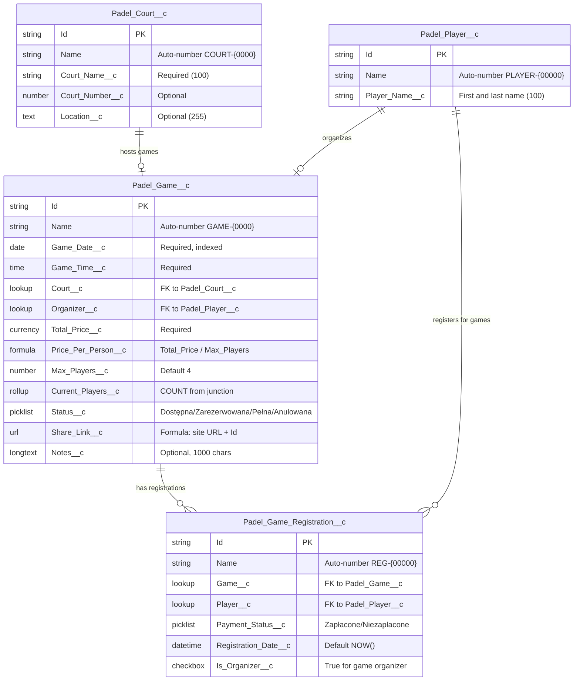
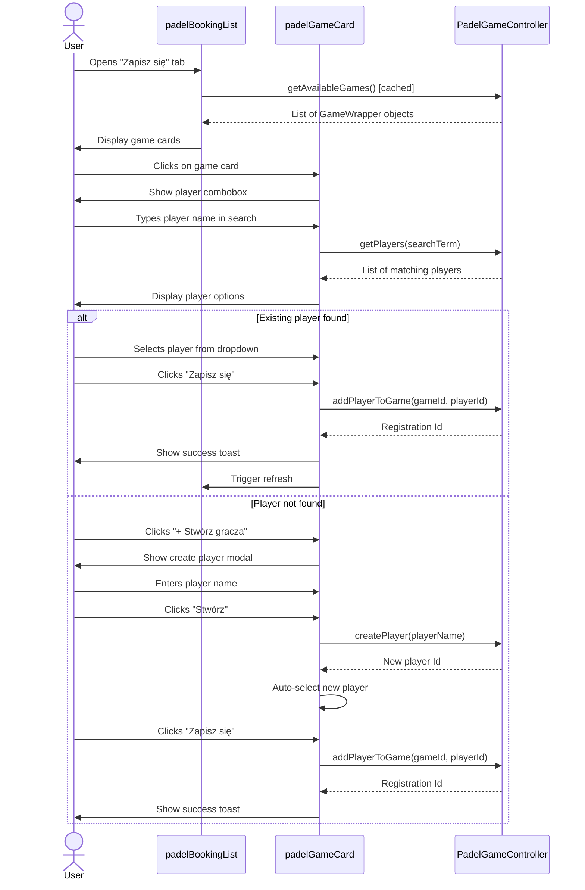
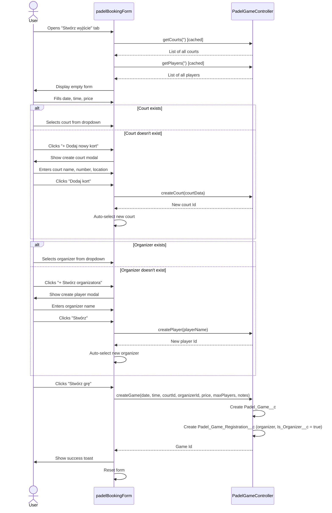

# Padel Booking Application - Redesigned Architecture (Junction Object Pattern)

## Executive Summary

### Overview
This document outlines a comprehensive redesign of the Padel Booking Application to implement a junction object pattern, enabling reusable player and court records across multiple games. The redesign transforms the current Master-Detail relationship into a many-to-many architecture, providing greater flexibility, data normalization, and scalability.

### Key Changes from Current Architecture

**Data Model Transformation:**
- **Padel_Player__c**: Changed from Master-Detail child to standalone master object (reusable across games)
- **Padel_Court__c**: NEW standalone master object (replaces picklist)
- **Padel_Game_Registration__c**: NEW junction object (replaces Master-Detail relationship)
- **Padel_Game__c**: Updated with Organizer lookup and Court lookup

**UI/UX Simplification:**
- Removed "Moje gry" tab (game management)
- Removed padelCreatedGameItem component
- Added searchable player/court selection with inline creation
- Simplified to two-tab interface: Browse/Join games + Create game

**Business Benefits:**
- Players don't need to re-enter their name for each game
- Courts are managed centrally (easy to add new venues)
- Organizer role can be transferred without deleting game
- Better data quality through reuse and normalization
- Simplified user experience

### Migration Impact
- Requires data migration from existing Master-Detail to Junction pattern
- Guest User permissions must be updated for new objects
- LWC components require moderate refactoring (UI patterns, not logic)
- Apex controller methods need signature changes

---

## 1. Data Model Architecture

### Entity Relationship Diagram



### Relationship Architecture

**Many-to-Many:**
- Padel_Game__c ←→ Padel_Player__c (via Padel_Game_Registration__c junction)
- One player can register for multiple games
- One game can have multiple players

**One-to-Many:**
- Padel_Court__c → Padel_Game__c (one court hosts many games)
- Padel_Player__c → Padel_Game__c (one player organizes many games)

**Cardinality:**
- Game → Registrations: 0 to Max_Players__c (typically 4)
- Player → Registrations: 0 to unlimited
- Court → Games: 0 to unlimited
- Organizer → Games: 0 to unlimited

---

## 2. Object Definitions

### Padel_Game__c (Master Object)

**Purpose**: Represents a bookable padel game session

| Field API Name | Type | Properties | Business Logic |
|---------------|------|------------|----------------|
| `Name` | Auto Number | Format: GAME-{0000} | System-generated unique ID |
| `Game_Date__c` | Date | Required, Indexed | Must be >= TODAY() (validation) |
| `Game_Time__c` | Time | Required | Start time (e.g., 18:00) |
| `Court__c` | Lookup(Padel_Court__c) | Required, No cascade delete | Reference to court venue |
| `Organizer__c` | Lookup(Padel_Player__c) | Required, No cascade delete | Player who created the game |
| `Total_Price__c` | Currency | Required, Min: 0 PLN | Total game cost |
| `Price_Per_Person__c` | Formula (Currency) | `Total_Price__c / Max_Players__c` | Auto-calculated |
| `Max_Players__c` | Number | Default: 4, Required | Range: 2-8 (validation) |
| `Current_Players__c` | Roll-Up Summary | COUNT(Padel_Game_Registration__c) | Auto-updated |
| `Status__c` | Picklist | Default: "Dostępna" | Values below |
| `Share_Link__c` | Formula (URL) | Site URL + Id | Auto-generated shareable link |
| `Day_Of_Week__c` | Formula (Text) | Polish day name | Pn/Wt/Śr/Cz/Pt/So/Nd |
| `Notes__c` | Long Text Area | Optional, 1000 chars | Additional info (e.g., "Kort numer 2") |

**Status__c Picklist Values:**
- `Dostępna` (Available) - Current_Players < Max_Players - 1
- `Zarezerwowana` (Reserved) - Current_Players = Max_Players - 1
- `Pełna` (Full) - Current_Players >= Max_Players
- `Anulowana` (Cancelled) - Manually cancelled

**Validation Rules:**

```apex
// VR: Game_Date_Must_Be_Future
AND(
    ISNEW(),
    Game_Date__c < TODAY()
)
// Error: "Data gry musi być w przyszłości"

// VR: Max_Players_Range
OR(
    Max_Players__c < 2,
    Max_Players__c > 8
)
// Error: "Liczba graczy musi być między 2 a 8"

// VR: Total_Price_Positive
Total_Price__c <= 0
// Error: "Cena musi być większa niż 0"

// VR: Organizer_Required
ISBLANK(Organizer__c)
// Error: "Musisz wybrać organizatora gry"

// VR: Court_Required
ISBLANK(Court__c)
// Error: "Musisz wybrać kort"
```

**Formula Fields:**

```apex
// Price_Per_Person__c (Currency)
Total_Price__c / Max_Players__c

// Share_Link__c (URL) - adjusted for Force.com Sites
"https://" & $Setup.OrganizationSettings.BaseUrl & "/padelbooking?id=" & Id

// Day_Of_Week__c (Text)
TEXT(CASE(MOD(Game_Date__c - DATE(1900, 1, 7), 7),
    0, "Niedziela",
    1, "Poniedziałek",
    2, "Wtorek",
    3, "Środa",
    4, "Czwartek",
    5, "Piątek",
    6, "Sobota",
    "Błąd"
))
```

**Roll-Up Summary:**

```
Field: Current_Players__c
Object to Summarize: Padel_Game_Registration__c
Roll-Up Type: COUNT
Filter: None (count all registrations)
```

---

### Padel_Player__c (Master Object - REDESIGNED)

**Purpose**: Represents a reusable player profile (no longer Master-Detail child)

| Field API Name | Type | Properties | Business Logic |
|---------------|------|------------|----------------|
| `Name` | Auto Number | Format: PLAYER-{00000} | System-generated |
| `Player_Name__c` | Text(100) | Required | First and last name (e.g., "Jan Kowalski") |

**Changes from Previous Design:**
- **REMOVED**: Master-Detail relationship to Padel_Game__c
- **REMOVED**: `Email__c` field (no longer required)
- **REMOVED**: `Phone__c` field (no longer required)
- **REMOVED**: `Payment_Status__c` (moved to junction object)
- **REMOVED**: `Registration_Date__c` (moved to junction object)

**Rationale:**
- Players are now standalone entities reusable across multiple games
- Contact information (email/phone) removed per requirement (Q11 - no player validation)
- Payment tracking moved to junction object (per-game basis)

**Validation Rules:**

```apex
// VR: Player_Name_Required
ISBLANK(Player_Name__c)
// Error: "Imię gracza jest wymagane"

// Note: No unique name validation per requirements (Q11)
```

---

### Padel_Court__c (NEW Master Object)

**Purpose**: Represents a padel court venue (replaces picklist)

| Field API Name | Type | Properties | Business Logic |
|---------------|------|------------|----------------|
| `Name` | Auto Number | Format: COURT-{0000} | System-generated |
| `Court_Name__c` | Text(100) | Required, Unique | Court name (e.g., "Padel Arena Mokotów") |
| `Court_Number__c` | Number | Optional | Court number at venue (1, 2, 3, etc.) |
| `Location__c` | Text(255) | Optional | Address or description |

**Business Benefits:**
- Centralized court management (no need to update picklist values)
- Supports multiple courts at same venue (via Court_Number__c)
- Can track location/address for venue
- Enables future features (court ratings, booking history)

**Validation Rules:**

```apex
// VR: Court_Name_Required
ISBLANK(Court_Name__c)
// Error: "Nazwa kortu jest wymagana"

// Note: Unique constraint handled via duplicate rules (optional)
```

**Future Enhancement Considerations:**
- `Active__c` (Checkbox) - Deactivate courts without deleting
- `Hourly_Rate__c` (Currency) - Default pricing
- `Image_URL__c` (URL) - Court photo
- `Amenities__c` (Multi-picklist) - Parking, showers, equipment rental

---

### Padel_Game_Registration__c (NEW Junction Object)

**Purpose**: Links players to games (replaces Master-Detail relationship)

| Field API Name | Type | Properties | Business Logic |
|---------------|------|------------|----------------|
| `Name` | Auto Number | Format: REG-{00000} | System-generated |
| `Game__c` | Lookup(Padel_Game__c) | Required, Indexed | Reference to game |
| `Player__c` | Lookup(Padel_Player__c) | Required, Indexed | Reference to player |
| `Payment_Status__c` | Picklist | Default: "Niezapłacone" | Payment tracking |
| `Registration_Date__c` | DateTime | Default: NOW(), Required | When player joined |
| `Is_Organizer__c` | Checkbox | Default: false | Marks game organizer |

**Payment_Status__c Picklist Values:**
- `Niezapłacone` (Unpaid)
- `Zapłacone` (Paid)

**Validation Rules:**

```apex
// VR: Game_Required
ISBLANK(Game__c)
// Error: "Gra jest wymagana"

// VR: Player_Required
ISBLANK(Player__c)
// Error: "Gracz jest wymagany"

// Note: Duplicate registration validation deferred per Q10
// Future: Unique constraint on (Game__c, Player__c) composite key
```

**Indexes:**
- Composite index on (Game__c, Player__c) for performance
- Index on Registration_Date__c for chronological queries

**Delete Behavior:**
- If Game deleted → Cascade delete all registrations (via Apex trigger)
- If Player deleted → Prevent if registrations exist (via Apex trigger or keep orphaned records)

**Business Logic (via Apex):**
- Only one registration per game can have `Is_Organizer__c = true`
- Organizer cannot be removed from game (delete registration if Is_Organizer = true → transfer to another player first)

---

## 3. Apex Controller Specification

### PadelGameController.cls (without sharing)

**Purpose**: Provides public API for Guest Users to interact with game data

**Class Declaration:**

```apex
public without sharing class PadelGameController {
    // All methods use @AuraEnabled for LWC access
    // without sharing = Guest User full CRUD access
}
```

---

#### Method: getAvailableGames()

**Purpose**: Retrieve all games that are not full or cancelled

**Signature:**
```apex
@AuraEnabled(cacheable=true)
public static List<GameWrapper> getAvailableGames()
```

**Return Type: GameWrapper**
```apex
public class GameWrapper {
    @AuraEnabled public Id gameId;
    @AuraEnabled public String gameName;
    @AuraEnabled public Date gameDate;
    @AuraEnabled public Time gameTime;
    @AuraEnabled public String dayOfWeek;
    @AuraEnabled public String courtName;
    @AuraEnabled public String courtLocation;
    @AuraEnabled public Decimal totalPrice;
    @AuraEnabled public Decimal pricePerPerson;
    @AuraEnabled public Integer maxPlayers;
    @AuraEnabled public Integer currentPlayers;
    @AuraEnabled public String status;
    @AuraEnabled public String shareLink;
    @AuraEnabled public String notes;
    @AuraEnabled public String organizerName;
    @AuraEnabled public Id organizerId;
    @AuraEnabled public List<PlayerWrapper> players;
}

public class PlayerWrapper {
    @AuraEnabled public Id registrationId;
    @AuraEnabled public Id playerId;
    @AuraEnabled public String playerName;
    @AuraEnabled public String paymentStatus;
    @AuraEnabled public DateTime registrationDate;
    @AuraEnabled public Boolean isOrganizer;
}
```

**SOQL Query:**
```apex
SELECT Id, Name, Game_Date__c, Game_Time__c, Day_Of_Week__c,
       Court__r.Court_Name__c, Court__r.Court_Number__c, Court__r.Location__c,
       Organizer__r.Player_Name__c, Organizer__c,
       Total_Price__c, Price_Per_Person__c, Max_Players__c, Current_Players__c,
       Status__c, Share_Link__c, Notes__c,
       (SELECT Id, Player__c, Player__r.Player_Name__c,
               Payment_Status__c, Registration_Date__c, Is_Organizer__c
        FROM Padel_Game_Registrations__r
        ORDER BY Is_Organizer__c DESC, Registration_Date__c ASC)
FROM Padel_Game__c
WHERE Status__c IN ('Dostępna', 'Zarezerwowana')
  AND Game_Date__c >= TODAY()
ORDER BY Game_Date__c ASC, Game_Time__c ASC
LIMIT 50
```

**Business Logic:**
- Only show future games (Game_Date__c >= TODAY())
- Exclude full or cancelled games
- Organizer appears first in player list (ORDER BY Is_Organizer__c DESC)

---

#### Method: createGame()

**Purpose**: Create new game and automatically register organizer as first player

**Signature:**
```apex
@AuraEnabled
public static Id createGame(
    Date gameDate,
    Time gameTime,
    Id courtId,
    Id organizerPlayerId,
    Decimal totalPrice,
    Integer maxPlayers,
    String notes
)
```

**Parameters:**
- `gameDate`: Required, must be >= TODAY()
- `gameTime`: Required (e.g., 18:00:00)
- `courtId`: Required, must be valid Padel_Court__c Id
- `organizerPlayerId`: Required, must be valid Padel_Player__c Id
- `totalPrice`: Required, must be > 0
- `maxPlayers`: Optional, defaults to 4
- `notes`: Optional

**Return**: Id of created Padel_Game__c record

**Business Logic:**
```apex
// 1. Validate inputs
if (gameDate < System.today()) {
    throw new AuraHandledException('Data gry musi być w przyszłości');
}

// 2. Create Padel_Game__c
Padel_Game__c game = new Padel_Game__c(
    Game_Date__c = gameDate,
    Game_Time__c = gameTime,
    Court__c = courtId,
    Organizer__c = organizerPlayerId,
    Total_Price__c = totalPrice,
    Max_Players__c = maxPlayers != null ? maxPlayers : 4,
    Status__c = 'Dostępna',
    Notes__c = notes
);
insert game;

// 3. Auto-create first registration for organizer
Padel_Game_Registration__c orgReg = new Padel_Game_Registration__c(
    Game__c = game.Id,
    Player__c = organizerPlayerId,
    Payment_Status__c = 'Niezapłacone',
    Registration_Date__c = System.now(),
    Is_Organizer__c = true
);
insert orgReg;

return game.Id;
```

**Error Handling:**
- Invalid courtId → AuraHandledException("Wybrany kort nie istnieje")
- Invalid organizerPlayerId → AuraHandledException("Wybrany gracz nie istnieje")
- SOQL exception → Log error, return user-friendly message

---

#### Method: addPlayerToGame()

**Purpose**: Register existing player for a game

**Signature:**
```apex
@AuraEnabled
public static Id addPlayerToGame(Id gameId, Id playerId)
```

**Return**: Id of created Padel_Game_Registration__c record

**Business Logic:**
```apex
// 1. Validate game is not full
Padel_Game__c game = [SELECT Current_Players__c, Max_Players__c
                      FROM Padel_Game__c WHERE Id = :gameId];
if (game.Current_Players__c >= game.Max_Players__c) {
    throw new AuraHandledException('Gra jest już pełna');
}

// 2. Check for duplicate registration (optional - deferred per Q10)
List<Padel_Game_Registration__c> existing = [
    SELECT Id FROM Padel_Game_Registration__c
    WHERE Game__c = :gameId AND Player__c = :playerId
    LIMIT 1
];
if (!existing.isEmpty()) {
    throw new AuraHandledException('Ten gracz jest już zapisany do tej gry');
}

// 3. Create registration
Padel_Game_Registration__c reg = new Padel_Game_Registration__c(
    Game__c = gameId,
    Player__c = playerId,
    Payment_Status__c = 'Niezapłacone',
    Registration_Date__c = System.now(),
    Is_Organizer__c = false
);
insert reg;

return reg.Id;
```

---

#### Method: removePlayerFromGame()

**Purpose**: Delete player registration from game with optional auto-transfer of organizer role

**Signature:**
```apex
@AuraEnabled
public static void removePlayerFromGame(Id registrationId, Boolean autoTransferOrganizer)
```

**Parameters:**
- `registrationId`: Required - ID of Padel_Game_Registration__c to remove
- `autoTransferOrganizer`: Optional (default: false) - If true and player is organizer, automatically transfer role to next player

**Business Logic:**
```apex
// 1. Query registration with game info
Padel_Game_Registration__c reg = [
    SELECT Id, Is_Organizer__c, Game__c, Player__c
    FROM Padel_Game_Registration__c
    WHERE Id = :registrationId
];

// 2. Handle organizer removal
if (reg.Is_Organizer__c) {
    if (autoTransferOrganizer == true) {
        // Find next player in game (by earliest registration date)
        List<Padel_Game_Registration__c> otherPlayers = [
            SELECT Id, Player__c
            FROM Padel_Game_Registration__c
            WHERE Game__c = :reg.Game__c
              AND Id != :registrationId
            ORDER BY Registration_Date__c ASC
            LIMIT 1
        ];

        if (otherPlayers.isEmpty()) {
            throw new AuraHandledException(
                'Nie można usunąć jedynego gracza z gry. Usuń całą grę zamiast tego.'
            );
        }

        // Transfer organizer role
        Padel_Game_Registration__c newOrganizer = otherPlayers[0];
        newOrganizer.Is_Organizer__c = true;

        // Update game organizer lookup
        Padel_Game__c game = new Padel_Game__c(
            Id = reg.Game__c,
            Organizer__c = newOrganizer.Player__c
        );

        // Perform updates
        update newOrganizer;
        update game;

        // Delete original organizer registration
        delete reg;

    } else {
        // Block removal if autoTransfer not enabled
        throw new AuraHandledException(
            'Nie możesz usunąć organizatora. Włącz auto-transfer lub zmień organizatora najpierw.'
        );
    }
} else {
    // Regular player - delete normally
    delete reg;
}
```

**Error Handling:**
- Last player in game → Cannot remove (suggest deleting entire game)
- Invalid registrationId → Standard SOQL exception
- autoTransferOrganizer = false for organizer → AuraHandledException

---

#### Method: updatePaymentStatus()

**Purpose**: Update payment status for a player registration

**Signature:**
```apex
@AuraEnabled
public static void updatePaymentStatus(Id registrationId, String paymentStatus)
```

**Parameters:**
- `registrationId`: Required
- `paymentStatus`: Must be 'Zapłacone' or 'Niezapłacone'

**Business Logic:**
```apex
if (paymentStatus != 'Zapłacone' && paymentStatus != 'Niezapłacone') {
    throw new AuraHandledException('Nieprawidłowy status płatności');
}

Padel_Game_Registration__c reg = new Padel_Game_Registration__c(
    Id = registrationId,
    Payment_Status__c = paymentStatus
);
update reg;
```

---

#### Method: changeOrganizer()

**Purpose**: Transfer organizer role to another player

**Signature:**
```apex
@AuraEnabled
public static void changeOrganizer(Id gameId, Id newOrganizerPlayerId)
```

**Business Logic:**
```apex
// 1. Find current organizer registration
Padel_Game_Registration__c currentOrg = [
    SELECT Id FROM Padel_Game_Registration__c
    WHERE Game__c = :gameId AND Is_Organizer__c = true
    LIMIT 1
];

// 2. Find/create new organizer registration
List<Padel_Game_Registration__c> newOrgList = [
    SELECT Id FROM Padel_Game_Registration__c
    WHERE Game__c = :gameId AND Player__c = :newOrganizerPlayerId
    LIMIT 1
];

List<Padel_Game_Registration__c> toUpdate = new List<Padel_Game_Registration__c>();

// Remove organizer flag from current
if (currentOrg != null) {
    toUpdate.add(new Padel_Game_Registration__c(
        Id = currentOrg.Id,
        Is_Organizer__c = false
    ));
}

// Add organizer flag to new (or create if not registered)
if (!newOrgList.isEmpty()) {
    toUpdate.add(new Padel_Game_Registration__c(
        Id = newOrgList[0].Id,
        Is_Organizer__c = true
    ));
} else {
    // Create registration for new organizer
    insert new Padel_Game_Registration__c(
        Game__c = gameId,
        Player__c = newOrganizerPlayerId,
        Payment_Status__c = 'Niezapłacone',
        Registration_Date__c = System.now(),
        Is_Organizer__c = true
    );
}

if (!toUpdate.isEmpty()) {
    update toUpdate;
}

// 3. Update Game.Organizer__c lookup
update new Padel_Game__c(
    Id = gameId,
    Organizer__c = newOrganizerPlayerId
);
```

---

#### Method: getPlayers()

**Purpose**: Search for existing players by name (for combobox autocomplete)

**Signature:**
```apex
@AuraEnabled(cacheable=true)
public static List<PlayerOption> getPlayers(String searchTerm)
```

**Return Type:**
```apex
public class PlayerOption {
    @AuraEnabled public Id playerId;
    @AuraEnabled public String playerName;
    @AuraEnabled public Integer gameCount; // Optional: how many games played
}
```

**SOQL Query:**
```apex
String searchPattern = '%' + searchTerm + '%';
List<Padel_Player__c> players = [
    SELECT Id, Player_Name__c,
           (SELECT Id FROM Padel_Game_Registrations__r)
    FROM Padel_Player__c
    WHERE Player_Name__c LIKE :searchPattern
    ORDER BY Player_Name__c ASC
    LIMIT 20
];

// Transform to PlayerOption list
List<PlayerOption> options = new List<PlayerOption>();
for (Padel_Player__c p : players) {
    options.add(new PlayerOption(
        p.Id,
        p.Player_Name__c,
        p.Padel_Game_Registrations__r.size()
    ));
}
return options;
```

---

#### Method: createPlayer()

**Purpose**: Create new player record

**Signature:**
```apex
@AuraEnabled
public static Id createPlayer(String playerName)
```

**Business Logic:**
```apex
if (String.isBlank(playerName)) {
    throw new AuraHandledException('Imię gracza jest wymagane');
}

Padel_Player__c player = new Padel_Player__c(
    Player_Name__c = playerName.trim()
);
insert player;
return player.Id;
```

**Note**: No duplicate name validation per requirements (Q11)

---

#### Method: getCourts()

**Purpose**: Search for existing courts by name (for combobox autocomplete)

**Signature:**
```apex
@AuraEnabled(cacheable=true)
public static List<CourtOption> getCourts(String searchTerm)
```

**Return Type:**
```apex
public class CourtOption {
    @AuraEnabled public Id courtId;
    @AuraEnabled public String courtName;
    @AuraEnabled public Integer courtNumber;
    @AuraEnabled public String location;
}
```

**SOQL Query:**
```apex
String searchPattern = '%' + searchTerm + '%';
return [
    SELECT Id, Court_Name__c, Court_Number__c, Location__c
    FROM Padel_Court__c
    WHERE Court_Name__c LIKE :searchPattern
    ORDER BY Court_Name__c ASC
    LIMIT 20
];
```

---

#### Method: createCourt()

**Purpose**: Create new court record

**Signature:**
```apex
@AuraEnabled
public static Id createCourt(String courtName, Integer courtNumber, String location)
```

**Business Logic:**
```apex
if (String.isBlank(courtName)) {
    throw new AuraHandledException('Nazwa kortu jest wymagana');
}

Padel_Court__c court = new Padel_Court__c(
    Court_Name__c = courtName.trim(),
    Court_Number__c = courtNumber,
    Location__c = location
);
insert court;
return court.Id;
```

---

#### Method: getGameRegistrations()

**Purpose**: Get all player registrations for a specific game (for detailed view)

**Signature:**
```apex
@AuraEnabled(cacheable=true)
public static List<PlayerWrapper> getGameRegistrations(Id gameId)
```

**SOQL Query:**
```apex
return [
    SELECT Id, Player__c, Player__r.Player_Name__c,
           Payment_Status__c, Registration_Date__c, Is_Organizer__c
    FROM Padel_Game_Registration__c
    WHERE Game__c = :gameId
    ORDER BY Is_Organizer__c DESC, Registration_Date__c ASC
];
```

---

## 4. LWC Component Architecture

### Component Tree (Redesigned)

```
padelBookingApp (Root Container)
├── Tab 1: "Zapisz się" (Browse & Join)
│   └── padelBookingList
│       └── padelGameCard (for each game)
│           └── padelPlayerItem (for each player)
│
└── Tab 2: "Stwórz wyjście" (Create Game)
    └── padelBookingForm
        ├── Player Search Combobox + Create Modal
        └── Court Search Combobox + Create Modal

REMOVED:
- Tab 3: "Moje gry" (deleted)
- padelCreatedGameItem component (deleted)
```

---

### Component: padelBookingApp.js

**Purpose**: Root container with tab navigation

**Changes from Current:**
- Remove "Moje gry" tab
- Keep only two tabs: "Zapisz się" and "Stwórz wyjście"
- Simplified state management (no localStorage for "my games")

**Template:**
```html
<template>
    <lightning-card title="Padel Booking" icon-name="custom:custom14">
        <lightning-tabset>
            <!-- Tab 1: Browse and Join Games -->
            <lightning-tab label="Zapisz się" value="browse">
                <c-padel-booking-list></c-padel-booking-list>
            </lightning-tab>

            <!-- Tab 2: Create Game -->
            <lightning-tab label="Stwórz wyjście" value="create">
                <c-padel-booking-form></c-padel-booking-form>
            </lightning-tab>
        </lightning-tabset>
    </lightning-card>
</template>
```

**JavaScript:**
```javascript
import { LightningElement } from 'lwc';

export default class PadelBookingApp extends LightningElement {
    // Simplified - no localStorage management needed
}
```

---

### Component: padelBookingList.js

**Purpose**: Display list of available games

**Changes from Current:**
- Update wire service to handle new GameWrapper structure
- Display court name from Court__c lookup (not picklist)
- Display organizer name

**Wire Service:**
```javascript
import { wire } from 'lwc';
import getAvailableGames from '@salesforce/apex/PadelGameController.getAvailableGames';

@wire(getAvailableGames)
wiredGames({ error, data }) {
    if (data) {
        this.games = data; // Array of GameWrapper objects
    } else if (error) {
        // Handle error
    }
}
```

**Template:**
```html
<template>
    <div class="slds-p-around_medium">
        <lightning-input
            type="search"
            label="Szukaj gier"
            placeholder="Wpisz kort, datę lub cenę..."
            onchange={handleSearch}
        ></lightning-input>

        <div class="game-list">
            <template for:each={games} for:item="game">
                <c-padel-game-card
                    key={game.gameId}
                    game={game}
                    onplayeradded={handleRefresh}
                ></c-padel-game-card>
            </template>
        </div>
    </div>
</template>
```

---

### Component: padelGameCard.js

**Purpose**: Display individual game with player list and join functionality

**Changes from Current:**
- Replace text input with searchable player combobox
- Add "Stwórz gracza" button to open modal
- Display players from junction object (GameWrapper.players array)
- Show organizer badge

**Template:**
```html
<template>
    <lightning-card class="game-card">
        <!-- Game Header -->
        <div class="slds-p-around_medium">
            <div class="slds-grid slds-wrap">
                <div class="slds-col slds-size_1-of-2">
                    <p><strong>{game.courtName}</strong></p>
                    <p>{game.dayOfWeek}, {game.formattedDate}</p>
                    <p>{game.formattedTime}</p>
                </div>
                <div class="slds-col slds-size_1-of-2">
                    <p>Cena: {game.totalPrice} PLN</p>
                    <p>Za osobę: {game.pricePerPerson} PLN</p>
                    <p>Gracze: {game.currentPlayers}/{game.maxPlayers}</p>
                </div>
            </div>

            <!-- Player List -->
            <div class="slds-m-top_medium">
                <h3 class="slds-text-heading_small">Zapisani gracze:</h3>
                <template for:each={game.players} for:item="player">
                    <c-padel-player-item
                        key={player.registrationId}
                        player={player}
                        onpaymentupdate={handleRefresh}
                        onplayerremove={handleRefresh}
                    ></c-padel-player-item>
                </template>
            </div>

            <!-- Join Game Section -->
            <div class="slds-m-top_medium" if:false={isGameFull}>
                <h3 class="slds-text-heading_small">Dołącz do gry:</h3>

                <!-- Searchable Player Combobox -->
                <lightning-combobox
                    name="player"
                    label="Wybierz gracza"
                    placeholder="Szukaj gracza po imieniu..."
                    options={playerOptions}
                    value={selectedPlayerId}
                    onchange={handlePlayerSelect}
                ></lightning-combobox>

                <div class="slds-grid slds-gutters slds-m-top_small">
                    <div class="slds-col">
                        <lightning-button
                            variant="brand"
                            label="Zapisz się"
                            onclick={handleJoinGame}
                            disabled={isJoinDisabled}
                        ></lightning-button>
                    </div>
                    <div class="slds-col">
                        <lightning-button
                            variant="neutral"
                            label="+ Stwórz gracza"
                            onclick={openPlayerModal}
                        ></lightning-button>
                    </div>
                </div>
            </div>
        </div>
    </lightning-card>

    <!-- Create Player Modal -->
    <template if:true={showPlayerModal}>
        <section role="dialog" class="slds-modal slds-fade-in-open">
            <div class="slds-modal__container">
                <header class="slds-modal__header">
                    <h2 class="slds-text-heading_medium">Stwórz nowego gracza</h2>
                </header>
                <div class="slds-modal__content slds-p-around_medium">
                    <lightning-input
                        label="Imię i nazwisko"
                        value={newPlayerName}
                        onchange={handlePlayerNameChange}
                        required
                    ></lightning-input>
                </div>
                <footer class="slds-modal__footer">
                    <lightning-button
                        variant="neutral"
                        label="Anuluj"
                        onclick={closePlayerModal}
                    ></lightning-button>
                    <lightning-button
                        variant="brand"
                        label="Stwórz"
                        onclick={handleCreatePlayer}
                    ></lightning-button>
                </footer>
            </div>
        </section>
        <div class="slds-backdrop slds-backdrop_open"></div>
    </template>
</template>
```

**JavaScript:**
```javascript
import { LightningElement, api, wire } from 'lwc';
import getPlayers from '@salesforce/apex/PadelGameController.getPlayers';
import createPlayer from '@salesforce/apex/PadelGameController.createPlayer';
import addPlayerToGame from '@salesforce/apex/PadelGameController.addPlayerToGame';
import { ShowToastEvent } from 'lightning/platformShowToastEvent';
import { refreshApex } from '@salesforce/apex';

export default class PadelGameCard extends LightningElement {
    @api game; // GameWrapper from parent

    selectedPlayerId;
    playerOptions = [];
    showPlayerModal = false;
    newPlayerName = '';

    // Wire service for player search
    @wire(getPlayers, { searchTerm: '$searchTerm' })
    wiredPlayers({ error, data }) {
        if (data) {
            this.playerOptions = data.map(p => ({
                label: p.playerName,
                value: p.playerId
            }));
        }
    }

    get isGameFull() {
        return this.game.currentPlayers >= this.game.maxPlayers;
    }

    get isJoinDisabled() {
        return !this.selectedPlayerId;
    }

    handlePlayerSelect(event) {
        this.selectedPlayerId = event.detail.value;
    }

    openPlayerModal() {
        this.showPlayerModal = true;
    }

    closePlayerModal() {
        this.showPlayerModal = false;
        this.newPlayerName = '';
    }

    handlePlayerNameChange(event) {
        this.newPlayerName = event.target.value;
    }

    handleCreatePlayer() {
        createPlayer({ playerName: this.newPlayerName })
            .then(result => {
                // Auto-select newly created player
                this.selectedPlayerId = result;
                this.closePlayerModal();
                this.showToast('Sukces', 'Gracz został stworzony', 'success');
                // Refresh player options
                return refreshApex(this.wiredPlayersResult);
            })
            .catch(error => {
                this.showToast('Błąd', error.body.message, 'error');
            });
    }

    handleJoinGame() {
        addPlayerToGame({
            gameId: this.game.gameId,
            playerId: this.selectedPlayerId
        })
            .then(() => {
                this.showToast('Sukces', 'Zapisano do gry', 'success');
                this.selectedPlayerId = null;
                this.dispatchEvent(new CustomEvent('playeradded'));
            })
            .catch(error => {
                this.showToast('Błąd', error.body.message, 'error');
            });
    }

    showToast(title, message, variant) {
        this.dispatchEvent(new ShowToastEvent({ title, message, variant }));
    }
}
```

---

### Component: padelPlayerItem.js

**Purpose**: Display individual player registration with payment status and removal options

**Changes from Current:**
- Display data from Padel_Game_Registration__c (junction object)
- Show organizer badge if Is_Organizer__c = true
- Payment checkbox updates junction record
- Remove button deletes junction record
- **NEW**: Auto-transfer organizer checkbox when removing organizer

**Template:**
```html
<template>
    <div class="slds-grid slds-grid_vertical-align-center slds-m-top_x-small">
        <div class="slds-col slds-size_1-of-2">
            <span>{player.playerName}</span>
            <template if:true={player.isOrganizer}>
                <lightning-badge label="Organizator" class="slds-m-left_x-small"></lightning-badge>
            </template>
        </div>
        <div class="slds-col slds-size_1-of-4">
            <lightning-input
                type="checkbox"
                label="Zapłacono"
                checked={isPaid}
                onchange={handlePaymentChange}
            ></lightning-input>
        </div>
        <div class="slds-col slds-size_1-of-4">
            <lightning-button-icon
                icon-name="utility:delete"
                variant="bare"
                alternative-text="Usuń"
                title="Usuń gracza"
                onclick={handleRemove}
            ></lightning-button-icon>
        </div>
    </div>

    <!-- Modal for Organizer Removal Confirmation -->
    <template if:true={showOrganizerModal}>
        <section role="dialog" class="slds-modal slds-fade-in-open">
            <div class="slds-modal__container">
                <header class="slds-modal__header">
                    <h2 class="slds-text-heading_medium">Usuń organizatora</h2>
                </header>
                <div class="slds-modal__content slds-p-around_medium">
                    <p class="slds-m-bottom_small">
                        Ten gracz jest organizatorem gry. Co chcesz zrobić?
                    </p>
                    <lightning-input
                        type="checkbox"
                        label="Automatycznie przenieś rolę organizatora na następnego gracza"
                        checked={autoTransferOrganizer}
                        onchange={handleAutoTransferChange}
                    ></lightning-input>
                </div>
                <footer class="slds-modal__footer">
                    <lightning-button
                        variant="neutral"
                        label="Anuluj"
                        onclick={closeOrganizerModal}
                    ></lightning-button>
                    <lightning-button
                        variant="destructive"
                        label="Usuń gracza"
                        onclick={confirmRemoveOrganizer}
                    ></lightning-button>
                </footer>
            </div>
        </section>
        <div class="slds-backdrop slds-backdrop_open"></div>
    </template>
</template>
```

**JavaScript:**
```javascript
import { LightningElement, api } from 'lwc';
import updatePaymentStatus from '@salesforce/apex/PadelGameController.updatePaymentStatus';
import removePlayerFromGame from '@salesforce/apex/PadelGameController.removePlayerFromGame';
import { ShowToastEvent } from 'lightning/platformShowToastEvent';

export default class PadelPlayerItem extends LightningElement {
    @api player; // PlayerWrapper from parent

    showOrganizerModal = false;
    autoTransferOrganizer = false;

    get isPaid() {
        return this.player.paymentStatus === 'Zapłacone';
    }

    handlePaymentChange(event) {
        const newStatus = event.target.checked ? 'Zapłacone' : 'Niezapłacone';
        updatePaymentStatus({
            registrationId: this.player.registrationId,
            paymentStatus: newStatus
        })
            .then(() => {
                this.dispatchEvent(new CustomEvent('paymentupdate'));
            })
            .catch(error => {
                this.showToast('Błąd', error.body.message, 'error');
            });
    }

    handleRemove() {
        // If player is organizer, show modal for auto-transfer option
        if (this.player.isOrganizer) {
            this.showOrganizerModal = true;
            return;
        }

        // Regular player - simple confirmation
        if (!confirm('Czy na pewno chcesz usunąć tego gracza?')) {
            return;
        }

        this.performRemove(false);
    }

    handleAutoTransferChange(event) {
        this.autoTransferOrganizer = event.target.checked;
    }

    closeOrganizerModal() {
        this.showOrganizerModal = false;
        this.autoTransferOrganizer = false;
    }

    confirmRemoveOrganizer() {
        this.showOrganizerModal = false;
        this.performRemove(this.autoTransferOrganizer);
    }

    performRemove(autoTransfer) {
        removePlayerFromGame({
            registrationId: this.player.registrationId,
            autoTransferOrganizer: autoTransfer
        })
            .then(() => {
                this.showToast('Sukces', 'Gracz został usunięty', 'success');
                this.dispatchEvent(new CustomEvent('playerremove'));
            })
            .catch(error => {
                this.showToast('Błąd', error.body.message, 'error');
            })
            .finally(() => {
                this.autoTransferOrganizer = false;
            });
    }

    showToast(title, message, variant) {
        this.dispatchEvent(new ShowToastEvent({ title, message, variant }));
    }
}
```

---

### Component: padelBookingForm.js

**Purpose**: Create new game with court/organizer selection

**Changes from Current:**
- Replace Court_Name__c picklist with searchable combobox
- Add Organizer__c selection (searchable player combobox)
- Add "Dodaj nowy kort" button + modal
- Add "Stwórz organizatora" button + modal
- Call createGame() with lookup Ids (not picklist values)

**Template:**
```html
<template>
    <div class="slds-p-around_medium">
        <h2 class="slds-text-heading_medium slds-m-bottom_medium">Stwórz nową grę</h2>

        <!-- Game Date -->
        <lightning-input
            type="date"
            label="Data gry"
            value={gameDate}
            onchange={handleDateChange}
            required
        ></lightning-input>

        <!-- Game Time -->
        <lightning-input
            type="time"
            label="Godzina"
            value={gameTime}
            onchange={handleTimeChange}
            required
        ></lightning-input>

        <!-- Court Selection (Searchable) -->
        <div class="slds-m-top_medium">
            <lightning-combobox
                name="court"
                label="Kort"
                placeholder="Szukaj kortu..."
                options={courtOptions}
                value={selectedCourtId}
                onchange={handleCourtSelect}
                required
            ></lightning-combobox>
            <lightning-button
                variant="neutral"
                label="+ Dodaj nowy kort"
                onclick={openCourtModal}
                class="slds-m-top_x-small"
            ></lightning-button>
        </div>

        <!-- Organizer Selection (Searchable) -->
        <div class="slds-m-top_medium">
            <lightning-combobox
                name="organizer"
                label="Organizator"
                placeholder="Szukaj gracza..."
                options={organizerOptions}
                value={selectedOrganizerId}
                onchange={handleOrganizerSelect}
                required
            ></lightning-combobox>
            <lightning-button
                variant="neutral"
                label="+ Stwórz organizatora"
                onclick={openOrganizerModal}
                class="slds-m-top_x-small"
            ></lightning-button>
        </div>

        <!-- Total Price -->
        <lightning-input
            type="number"
            label="Cena całkowita (PLN)"
            value={totalPrice}
            onchange={handlePriceChange}
            min="0"
            step="10"
            required
        ></lightning-input>

        <!-- Max Players -->
        <lightning-input
            type="number"
            label="Maksymalna liczba graczy"
            value={maxPlayers}
            onchange={handleMaxPlayersChange}
            min="2"
            max="8"
        ></lightning-input>

        <!-- Notes -->
        <lightning-textarea
            label="Dodatkowe informacje"
            value={notes}
            onchange={handleNotesChange}
            maxlength="1000"
        ></lightning-textarea>

        <!-- Submit Button -->
        <lightning-button
            variant="brand"
            label="Stwórz grę"
            onclick={handleCreateGame}
            class="slds-m-top_medium"
        ></lightning-button>
    </div>

    <!-- Create Court Modal -->
    <template if:true={showCourtModal}>
        <section role="dialog" class="slds-modal slds-fade-in-open">
            <div class="slds-modal__container">
                <header class="slds-modal__header">
                    <h2 class="slds-text-heading_medium">Dodaj nowy kort</h2>
                </header>
                <div class="slds-modal__content slds-p-around_medium">
                    <lightning-input
                        label="Nazwa kortu"
                        value={newCourtName}
                        onchange={handleCourtNameChange}
                        required
                    ></lightning-input>
                    <lightning-input
                        type="number"
                        label="Numer kortu (opcjonalnie)"
                        value={newCourtNumber}
                        onchange={handleCourtNumberChange}
                    ></lightning-input>
                    <lightning-input
                        label="Lokalizacja (opcjonalnie)"
                        value={newCourtLocation}
                        onchange={handleCourtLocationChange}
                    ></lightning-input>
                </div>
                <footer class="slds-modal__footer">
                    <lightning-button
                        variant="neutral"
                        label="Anuluj"
                        onclick={closeCourtModal}
                    ></lightning-button>
                    <lightning-button
                        variant="brand"
                        label="Dodaj kort"
                        onclick={handleCreateCourt}
                    ></lightning-button>
                </footer>
            </div>
        </section>
        <div class="slds-backdrop slds-backdrop_open"></div>
    </template>

    <!-- Create Organizer Modal (similar to Create Player) -->
    <template if:true={showOrganizerModal}>
        <section role="dialog" class="slds-modal slds-fade-in-open">
            <div class="slds-modal__container">
                <header class="slds-modal__header">
                    <h2 class="slds-text-heading_medium">Stwórz organizatora</h2>
                </header>
                <div class="slds-modal__content slds-p-around_medium">
                    <lightning-input
                        label="Imię i nazwisko"
                        value={newOrganizerName}
                        onchange={handleOrganizerNameChange}
                        required
                    ></lightning-input>
                </div>
                <footer class="slds-modal__footer">
                    <lightning-button
                        variant="neutral"
                        label="Anuluj"
                        onclick={closeOrganizerModal}
                    ></lightning-button>
                    <lightning-button
                        variant="brand"
                        label="Stwórz"
                        onclick={handleCreateOrganizer}
                    ></lightning-button>
                </footer>
            </div>
        </section>
        <div class="slds-backdrop slds-backdrop_open"></div>
    </template>
</template>
```

**JavaScript:**
```javascript
import { LightningElement, wire } from 'lwc';
import getCourts from '@salesforce/apex/PadelGameController.getCourts';
import createCourt from '@salesforce/apex/PadelGameController.createCourt';
import getPlayers from '@salesforce/apex/PadelGameController.getPlayers';
import createPlayer from '@salesforce/apex/PadelGameController.createPlayer';
import createGame from '@salesforce/apex/PadelGameController.createGame';
import { ShowToastEvent } from 'lightning/platformShowToastEvent';
import { refreshApex } from '@salesforce/apex';

export default class PadelBookingForm extends LightningElement {
    // Form fields
    gameDate;
    gameTime;
    selectedCourtId;
    selectedOrganizerId;
    totalPrice = 200;
    maxPlayers = 4;
    notes;

    // Options for comboboxes
    courtOptions = [];
    organizerOptions = [];

    // Modal states
    showCourtModal = false;
    showOrganizerModal = false;
    newCourtName;
    newCourtNumber;
    newCourtLocation;
    newOrganizerName;

    // Wire courts
    @wire(getCourts, { searchTerm: '' })
    wiredCourts({ error, data }) {
        if (data) {
            this.courtOptions = data.map(c => ({
                label: `${c.courtName}${c.courtNumber ? ' (Kort ' + c.courtNumber + ')' : ''}`,
                value: c.courtId
            }));
        }
    }

    // Wire organizers (players)
    @wire(getPlayers, { searchTerm: '' })
    wiredOrganizers({ error, data }) {
        if (data) {
            this.organizerOptions = data.map(p => ({
                label: p.playerName,
                value: p.playerId
            }));
        }
    }

    // Event handlers
    handleDateChange(event) { this.gameDate = event.target.value; }
    handleTimeChange(event) { this.gameTime = event.target.value; }
    handleCourtSelect(event) { this.selectedCourtId = event.detail.value; }
    handleOrganizerSelect(event) { this.selectedOrganizerId = event.detail.value; }
    handlePriceChange(event) { this.totalPrice = event.target.value; }
    handleMaxPlayersChange(event) { this.maxPlayers = event.target.value; }
    handleNotesChange(event) { this.notes = event.target.value; }

    // Court modal handlers
    openCourtModal() { this.showCourtModal = true; }
    closeCourtModal() {
        this.showCourtModal = false;
        this.newCourtName = '';
        this.newCourtNumber = null;
        this.newCourtLocation = '';
    }
    handleCourtNameChange(event) { this.newCourtName = event.target.value; }
    handleCourtNumberChange(event) { this.newCourtNumber = event.target.value; }
    handleCourtLocationChange(event) { this.newCourtLocation = event.target.value; }

    handleCreateCourt() {
        createCourt({
            courtName: this.newCourtName,
            courtNumber: this.newCourtNumber,
            location: this.newCourtLocation
        })
            .then(result => {
                this.selectedCourtId = result;
                this.closeCourtModal();
                this.showToast('Sukces', 'Kort został dodany', 'success');
                return refreshApex(this.wiredCourtsResult);
            })
            .catch(error => {
                this.showToast('Błąd', error.body.message, 'error');
            });
    }

    // Organizer modal handlers
    openOrganizerModal() { this.showOrganizerModal = true; }
    closeOrganizerModal() {
        this.showOrganizerModal = false;
        this.newOrganizerName = '';
    }
    handleOrganizerNameChange(event) { this.newOrganizerName = event.target.value; }

    handleCreateOrganizer() {
        createPlayer({ playerName: this.newOrganizerName })
            .then(result => {
                this.selectedOrganizerId = result;
                this.closeOrganizerModal();
                this.showToast('Sukces', 'Organizator został stworzony', 'success');
                return refreshApex(this.wiredOrganizersResult);
            })
            .catch(error => {
                this.showToast('Błąd', error.body.message, 'error');
            });
    }

    // Create game
    handleCreateGame() {
        // Validation
        if (!this.gameDate || !this.gameTime || !this.selectedCourtId || !this.selectedOrganizerId) {
            this.showToast('Błąd', 'Wypełnij wszystkie wymagane pola', 'error');
            return;
        }

        createGame({
            gameDate: this.gameDate,
            gameTime: this.gameTime,
            courtId: this.selectedCourtId,
            organizerPlayerId: this.selectedOrganizerId,
            totalPrice: this.totalPrice,
            maxPlayers: this.maxPlayers,
            notes: this.notes
        })
            .then(() => {
                this.showToast('Sukces', 'Gra została stworzona', 'success');
                this.resetForm();
            })
            .catch(error => {
                this.showToast('Błąd', error.body.message, 'error');
            });
    }

    resetForm() {
        this.gameDate = null;
        this.gameTime = null;
        this.selectedCourtId = null;
        this.selectedOrganizerId = null;
        this.totalPrice = 200;
        this.maxPlayers = 4;
        this.notes = '';
    }

    showToast(title, message, variant) {
        this.dispatchEvent(new ShowToastEvent({ title, message, variant }));
    }
}
```

---

## 5. UI/UX Flows

### Flow 1: Browse and Join Game



**Wireframe: Game Card with Player Selection**

```
┌────────────────────────────────────────────────┐
│ Kort Centralny                   200 PLN       │
│ Poniedziałek, 26.10.2025        50 PLN/osoba  │
│ 18:00                            Gracze: 2/4   │
├────────────────────────────────────────────────┤
│ Zapisani gracze:                               │
│ ✓ Jan Kowalski [Organizator] ☑ Zapłacone  [X]│
│ ✓ Anna Nowak                  ☐ Niezapłacone│
├────────────────────────────────────────────────┤
│ Dołącz do gry:                                 │
│ [Wybierz gracza ▼] [Zapisz się] [+ Stwórz]   │
└────────────────────────────────────────────────┘
```

---

### Flow 2: Create New Game with Court Selection



**Wireframe: Create Game Form**

```
┌────────────────────────────────────────────────┐
│ Stwórz nową grę                                │
├────────────────────────────────────────────────┤
│ Data gry:         [2025-10-27        ]         │
│ Godzina:          [18:00             ]         │
│                                                │
│ Kort:             [Kort Centralny    ▼]        │
│                   [+ Dodaj nowy kort]          │
│                                                │
│ Organizator:      [Jan Kowalski      ▼]        │
│                   [+ Stwórz organizatora]      │
│                                                │
│ Cena całkowita:   [200               ] PLN     │
│ Maks. graczy:     [4                 ]         │
│                                                │
│ Dodatkowe info:   [                          ]│
│                   [                          ]│
│                                                │
│                   [Stwórz grę]                 │
└────────────────────────────────────────────────┘
```

---

### Flow 3: Create Court Modal

**Wireframe: Add Court Modal**

```
┌────────────────────────────────────┐
│ Dodaj nowy kort              [X]   │
├────────────────────────────────────┤
│                                    │
│ Nazwa kortu:  [Padel Arena Mokotów]│
│               (wymagane)           │
│                                    │
│ Numer kortu:  [2                  ]│
│               (opcjonalnie)        │
│                                    │
│ Lokalizacja:  [ul. Postępu 15     ]│
│               (opcjonalnie)        │
│                                    │
│         [Anuluj]    [Dodaj kort]   │
└────────────────────────────────────┘
```

---

### Flow 4: Create Player/Organizer Modal

**Wireframe: Create Player Modal**

```
┌────────────────────────────────────┐
│ Stwórz nowego gracza          [X]  │
├────────────────────────────────────┤
│                                    │
│ Imię i nazwisko:                   │
│ [Jan Kowalski                    ] │
│ (wymagane)                         │
│                                    │
│                                    │
│         [Anuluj]       [Stwórz]    │
└────────────────────────────────────┘
```

---

## 6. Guest User Security Model

### Organization-Wide Defaults (OWD)

| Object | Default Internal Access | Default External Access | Grant Access Using Hierarchies |
|--------|------------------------|------------------------|--------------------------------|
| **Padel_Game__c** | Public Read/Write | Public Read/Write | Yes |
| **Padel_Player__c** | Public Read/Write | Public Read/Write | Yes |
| **Padel_Court__c** | Public Read/Write | Public Read/Write | Yes |
| **Padel_Game_Registration__c** | Public Read/Write | Public Read/Write | Yes |

**Rationale:**
- All objects must be Public Read/Write for Guest User access
- `without sharing` in Apex bypasses sharing rules
- Public application requires open access model

---

### Guest User Profile Permissions

**Setup → Digital Experiences → [Site] → Administration → Preferences → Guest User Profile**

**Object Permissions:**

| Object | Read | Create | Edit | Delete |
|--------|------|--------|------|--------|
| Padel_Game__c | ✓ | ✓ | ✓ | ✓ |
| Padel_Player__c | ✓ | ✓ | ✓ | ✗ |
| Padel_Court__c | ✓ | ✓ | ✓ | ✗ |
| Padel_Game_Registration__c | ✓ | ✓ | ✓ | ✓ |

**Rationale:**
- Games: Full CRUD (organizers can delete own games)
- Players: No delete (prevent data loss, players are reusable)
- Courts: No delete (prevent accidental removal of venue data)
- Registrations: Full CRUD (allow join/leave games)

**Field-Level Security:**
- ALL fields on ALL objects: **Visible = True, Read-Only = False**

**Apex Class Access:**
- ✓ PadelGameController (Enabled)

**Visualforce Page Access:**
- ✓ PadelBooking (Enabled)

---

### Security Risks & Mitigations

#### Risk 1: Malicious Data Entry (Spam Games/Players)

**Mitigation:**
1. **Rate Limiting in Apex**: Max 5 games created per IP address per hour
2. **Validation Rules**: Require realistic data (future dates, positive prices)
3. **Admin Moderation**: Scheduled job to flag suspicious games (e.g., 0 players after 24 hours)
4. **CAPTCHA**: Add reCAPTCHA to form submission (Phase 2)

```apex
// Example rate limiting logic
public class RateLimiter {
    private static final Integer MAX_GAMES_PER_HOUR = 5;

    public static void validateGameCreation() {
        String ipAddress = getClientIPAddress();
        Integer recentGames = [
            SELECT COUNT() FROM Padel_Game__c
            WHERE CreatedDate >= :System.now().addHours(-1)
            AND Creator_IP__c = :ipAddress
        ];

        if (recentGames >= MAX_GAMES_PER_HOUR) {
            throw new AuraHandledException('Limit tworzenia gier przekroczony');
        }
    }
}
```

#### Risk 2: Duplicate Player Names

**Status**: Accepted per requirements (Q11 - no validation)

**Future Enhancement:**
- Fuzzy matching to suggest existing players
- "Did you mean?" prompt when similar name found
- Admin tool to merge duplicate player records

#### Risk 3: Unauthorized Payment Status Changes

**Mitigation:**
- Payment status is informational only (no financial transactions)
- Future: Restrict payment updates to game organizer only (requires authentication)

#### Risk 4: XSS/Injection Attacks

**Mitigation:**
- LWC framework auto-sanitizes all outputs
- No use of `innerHTML` (prohibited by LWC)
- Validation rules enforce email/phone formats
- Long text fields (Notes__c) escaped by platform

---

## 7. Migration Plan

### Phase 1: Data Model Deployment (Pre-Migration)

**Objective**: Deploy new objects without breaking existing system

**Steps:**

1. **Deploy New Objects (No Data Impact)**
   ```bash
   sf project deploy start --source-dir force-app/main/default/objects/Padel_Court__c
   sf project deploy start --source-dir force-app/main/default/objects/Padel_Game_Registration__c
   ```

2. **Modify Padel_Player__c**
   - Remove Master-Detail to Padel_Game__c (requires data deletion if records exist)
   - Add standalone player records
   - **WARNING**: This is destructive! Backup data first.

3. **Update Padel_Game__c**
   - Add `Court__c` lookup field
   - Add `Organizer__c` lookup field
   - Keep `Court_Name__c` picklist temporarily for migration

---

### Phase 2: Data Migration Script

**Objective**: Convert existing Master-Detail data to Junction pattern

**⚠️ Important Notes:**
- Backup is **not required** per user confirmation, but **sandbox testing is strongly recommended**
- Migration involves deleting existing Padel_Player__c Master-Detail records
- Test migration script on sandbox before production deployment
- Estimated downtime: 5-10 minutes for small datasets (<1000 records)

**Apex Migration Script:**

```apex
public class PadelDataMigration {

    public static void migrateToJunctionPattern() {
        System.debug('Starting migration...');

        // Step 1: Create Padel_Court__c records from picklist values
        Map<String, Id> courtNameToId = createCourtRecords();

        // Step 2: Create standalone Padel_Player__c records
        Map<String, Id> playerNameToId = createPlayerRecords();

        // Step 3: Update Padel_Game__c with Court__c lookup
        updateGameCourts(courtNameToId);

        // Step 4: Create Padel_Game_Registration__c junction records
        createJunctionRecords(playerNameToId);

        // Step 5: Set Organizer__c on games (first player = organizer)
        setGameOrganizers();

        System.debug('Migration complete!');
    }

    private static Map<String, Id> createCourtRecords() {
        // Query unique court names from existing games
        List<String> courtNames = new List<String>();
        for (AggregateResult ar : [
            SELECT Court_Name__c
            FROM Padel_Game__c
            WHERE Court_Name__c != null
            GROUP BY Court_Name__c
        ]) {
            courtNames.add((String)ar.get('Court_Name__c'));
        }

        // Create Padel_Court__c records
        List<Padel_Court__c> courts = new List<Padel_Court__c>();
        for (String name : courtNames) {
            courts.add(new Padel_Court__c(Court_Name__c = name));
        }
        insert courts;

        // Map court name to Id
        Map<String, Id> courtMap = new Map<String, Id>();
        for (Padel_Court__c c : courts) {
            courtMap.put(c.Court_Name__c, c.Id);
        }

        System.debug('Created ' + courts.size() + ' court records');
        return courtMap;
    }

    private static Map<String, Id> createPlayerRecords() {
        // Query existing players (currently Master-Detail children)
        List<Padel_Player__c> oldPlayers = [
            SELECT Player_Name__c, Email__c, Game__c
            FROM Padel_Player__c
        ];

        // Create unique player records (deduplicate by name)
        Map<String, Padel_Player__c> uniquePlayers = new Map<String, Padel_Player__c>();
        for (Padel_Player__c p : oldPlayers) {
            if (!uniquePlayers.containsKey(p.Player_Name__c)) {
                uniquePlayers.put(p.Player_Name__c, new Padel_Player__c(
                    Player_Name__c = p.Player_Name__c
                    // Note: Email__c and Phone__c removed in new schema
                ));
            }
        }

        // Insert new standalone players
        insert uniquePlayers.values();

        // Map player name to Id
        Map<String, Id> playerMap = new Map<String, Id>();
        for (Padel_Player__c p : uniquePlayers.values()) {
            playerMap.put(p.Player_Name__c, p.Id);
        }

        System.debug('Created ' + playerMap.size() + ' unique player records');
        return playerMap;
    }

    private static void updateGameCourts(Map<String, Id> courtNameToId) {
        List<Padel_Game__c> games = [
            SELECT Id, Court_Name__c
            FROM Padel_Game__c
            WHERE Court_Name__c != null
        ];

        List<Padel_Game__c> gamesToUpdate = new List<Padel_Game__c>();
        for (Padel_Game__c g : games) {
            Id courtId = courtNameToId.get(g.Court_Name__c);
            if (courtId != null) {
                gamesToUpdate.add(new Padel_Game__c(
                    Id = g.Id,
                    Court__c = courtId
                ));
            }
        }

        update gamesToUpdate;
        System.debug('Updated ' + gamesToUpdate.size() + ' games with court lookups');
    }

    private static void createJunctionRecords(Map<String, Id> playerNameToId) {
        // Query old players (Master-Detail children)
        List<Padel_Player__c> oldPlayers = [
            SELECT Player_Name__c, Game__c, Payment_Status__c, Registration_Date__c
            FROM Padel_Player__c
        ];

        // Create junction records
        List<Padel_Game_Registration__c> registrations = new List<Padel_Game_Registration__c>();
        for (Padel_Player__c p : oldPlayers) {
            Id newPlayerId = playerNameToId.get(p.Player_Name__c);
            if (newPlayerId != null) {
                registrations.add(new Padel_Game_Registration__c(
                    Game__c = p.Game__c,
                    Player__c = newPlayerId,
                    Payment_Status__c = p.Payment_Status__c,
                    Registration_Date__c = p.Registration_Date__c,
                    Is_Organizer__c = false // Will set organizer in next step
                ));
            }
        }

        insert registrations;
        System.debug('Created ' + registrations.size() + ' junction records');
    }

    private static void setGameOrganizers() {
        // For each game, set first player as organizer
        List<Padel_Game__c> games = [
            SELECT Id,
                   (SELECT Player__c FROM Padel_Game_Registrations__r
                    ORDER BY Registration_Date__c ASC LIMIT 1)
            FROM Padel_Game__c
        ];

        List<Padel_Game__c> gamesToUpdate = new List<Padel_Game__c>();
        List<Padel_Game_Registration__c> regsToUpdate = new List<Padel_Game_Registration__c>();

        for (Padel_Game__c g : games) {
            if (!g.Padel_Game_Registrations__r.isEmpty()) {
                Padel_Game_Registration__c firstReg = g.Padel_Game_Registrations__r[0];

                // Set organizer on game
                gamesToUpdate.add(new Padel_Game__c(
                    Id = g.Id,
                    Organizer__c = firstReg.Player__c
                ));

                // Mark first registration as organizer
                regsToUpdate.add(new Padel_Game_Registration__c(
                    Id = firstReg.Id,
                    Is_Organizer__c = true
                ));
            }
        }

        update gamesToUpdate;
        update regsToUpdate;
        System.debug('Set organizers for ' + gamesToUpdate.size() + ' games');
    }
}
```

**Execution:**
```apex
// Execute in Developer Console
PadelDataMigration.migrateToJunctionPattern();
```

---

### Phase 3: Code Deployment

**Objective**: Deploy updated Apex and LWC components

**Steps:**

1. **Deploy Updated Apex Controller**
   ```bash
   sf project deploy start --source-dir force-app/main/default/classes/PadelGameController.cls
   sf project deploy start --source-dir force-app/main/default/classes/PadelGameControllerTest.cls
   ```

2. **Run Apex Tests**
   ```bash
   sf apex run test --test-level RunLocalTests --code-coverage
   # Verify 75%+ coverage
   ```

3. **Deploy Updated LWC Components**
   ```bash
   sf project deploy start --source-dir force-app/main/default/lwc/padelBookingApp
   sf project deploy start --source-dir force-app/main/default/lwc/padelBookingList
   sf project deploy start --source-dir force-app/main/default/lwc/padelGameCard
   sf project deploy start --source-dir force-app/main/default/lwc/padelPlayerItem
   sf project deploy start --source-dir force-app/main/default/lwc/padelBookingForm
   ```

4. **Remove Deprecated Components**
   ```bash
   sf project delete source --source-dir force-app/main/default/lwc/padelCreatedGameItem
   ```

---

### Phase 4: Guest User Permission Update

**Manual Steps in Setup:**

1. **Setup → Digital Experiences → [Site] → Public Access Settings**
   - Add Padel_Court__c: Read, Create, Edit
   - Add Padel_Game_Registration__c: Read, Create, Edit, Delete
   - Update Padel_Player__c: Remove Master-Detail permissions, add standalone CRUD

2. **Setup → Sharing Settings**
   - Set OWD for Padel_Court__c: Public Read/Write
   - Set OWD for Padel_Game_Registration__c: Public Read/Write
   - Update Padel_Player__c: Public Read/Write (no longer Controlled by Parent)

---

### Phase 5: Data Cleanup

**Objective**: Remove old Master-Detail data after validation

**Steps:**

1. **Verify Junction Records Created**
   ```apex
   Integer junctionCount = [SELECT COUNT() FROM Padel_Game_Registration__c];
   Integer oldPlayerCount = [SELECT COUNT() FROM Padel_Player__c];
   System.assert(junctionCount >= oldPlayerCount, 'Migration incomplete');
   ```

2. **Delete Old Master-Detail Players**
   ```apex
   // WARNING: Destructive operation!
   delete [SELECT Id FROM Padel_Player__c WHERE Game__c != null];
   ```

3. **Remove Court_Name__c Picklist Field**
   - Setup → Object Manager → Padel_Game__c → Fields
   - Delete `Court_Name__c` (no longer needed, replaced by Court__c lookup)

---

### Rollback Plan

**If migration fails:**

1. **Restore from Backup**
   - Use Change Sets or data loader to restore pre-migration state
   - Re-import deleted Master-Detail Padel_Player__c records

2. **Revert Code**
   ```bash
   git checkout main
   sf project deploy start --source-dir force-app/
   ```

3. **Investigate Failure**
   - Check debug logs for Apex errors
   - Validate data integrity (duplicate players, missing courts)
   - Fix issues and retry migration

---

## 8. Deployment Checklist

### Pre-Deployment Validation

- [ ] Backup all data (Padel_Game__c, Padel_Player__c)
- [ ] Export data using Data Loader (CSV backup)
- [ ] Run all Apex tests in sandbox (75%+ coverage required)
- [ ] Validate migration script in scratch org
- [ ] Review Guest User permissions in sandbox
- [ ] Test UI in sandbox (Chrome, Firefox, Safari, mobile)

---

### Deployment Steps (Production)

**Step 1: Deploy New Objects**
- [ ] Deploy Padel_Court__c object
- [ ] Deploy Padel_Game_Registration__c object
- [ ] Verify objects created in Setup → Object Manager

**Step 2: Modify Existing Objects**
- [ ] Add `Court__c` lookup to Padel_Game__c
- [ ] Add `Organizer__c` lookup to Padel_Game__c
- [ ] Remove Master-Detail from Padel_Player__c (requires data deletion warning)
- [ ] Update Padel_Player__c to standalone object

**Step 3: Run Data Migration**
- [ ] Execute `PadelDataMigration.migrateToJunctionPattern()` in Developer Console
- [ ] Monitor debug logs for errors
- [ ] Validate record counts:
  ```apex
  System.debug('Courts: ' + [SELECT COUNT() FROM Padel_Court__c]);
  System.debug('Players: ' + [SELECT COUNT() FROM Padel_Player__c]);
  System.debug('Registrations: ' + [SELECT COUNT() FROM Padel_Game_Registration__c]);
  ```

**Step 4: Deploy Apex Code**
- [ ] Deploy PadelGameController.cls
- [ ] Deploy PadelGameControllerTest.cls
- [ ] Run tests: `sf apex run test --test-level RunLocalTests`
- [ ] Verify 75%+ code coverage

**Step 5: Deploy LWC Components**
- [ ] Deploy padelBookingApp
- [ ] Deploy padelBookingList
- [ ] Deploy padelGameCard
- [ ] Deploy padelPlayerItem
- [ ] Deploy padelBookingForm
- [ ] Delete padelCreatedGameItem (deprecated)

**Step 6: Update Guest User Permissions**
- [ ] Setup → Digital Experiences → [Site] → Public Access Settings
- [ ] Add Padel_Court__c permissions (Read, Create, Edit)
- [ ] Add Padel_Game_Registration__c permissions (Read, Create, Edit, Delete)
- [ ] Update Padel_Player__c permissions (standalone CRUD)
- [ ] Enable all field-level security for new objects

**Step 7: Update Sharing Settings**
- [ ] Setup → Sharing Settings
- [ ] Set Padel_Court__c OWD: Public Read/Write
- [ ] Set Padel_Game_Registration__c OWD: Public Read/Write
- [ ] Update Padel_Player__c OWD: Public Read/Write

**Step 8: Clear Site Cache**
- [ ] Setup → Digital Experiences → [Site] → Workspaces
- [ ] Clear cache to force reload of components

**Step 9: Smoke Testing**
- [ ] Open public site URL
- [ ] Test: Browse games (verify court names display from lookup)
- [ ] Test: Join game (search player, select, add to game)
- [ ] Test: Create new player (modal opens, player created, auto-selected)
- [ ] Test: Create game (select court, organizer, create game)
- [ ] Test: Create new court (modal opens, court created, auto-selected)
- [ ] Test: Payment status update (checkbox toggles)
- [ ] Test: Remove player from game (delete junction record)

---

### Post-Deployment Validation

- [ ] Verify all existing games display correctly
- [ ] Verify player counts match (junction count = old player count)
- [ ] Verify organizers set correctly (first player = organizer)
- [ ] Test mobile responsiveness (iOS, Android)
- [ ] Monitor error logs for 24 hours
- [ ] Check Guest User API usage (Setup → System Overview)

---

### Rollback Procedure (If Needed)

**If critical issues found:**

1. **Immediate Actions**
   - [ ] Deactivate Force.com Site (Setup → Sites → Deactivate)
   - [ ] Notify users via social media/email

2. **Revert Deployment**
   - [ ] Restore data from CSV backup (Data Loader)
   - [ ] Revert code to previous version:
     ```bash
     git checkout <previous-commit-hash>
     sf project deploy start --source-dir force-app/
     ```

3. **Investigate Issues**
   - [ ] Review debug logs (Setup → Debug Logs)
   - [ ] Identify root cause (data migration error, Apex bug, etc.)
   - [ ] Fix issues in sandbox
   - [ ] Re-test before retry

4. **Re-Activate Site**
   - [ ] After fix validated, re-deploy
   - [ ] Re-activate site
   - [ ] Monitor for 48 hours

---

## 9. Testing Strategy

**✅ Test Coverage Requirements:**
- **Automated test coverage (75%) is NOT required** for this MVP deployment
- Manual testing is sufficient for initial release
- Test class provided below for future use and best practices
- Production deployment can proceed with manual UAT validation

### Apex Test Class: PadelGameControllerTest.cls

**Test Coverage Goals (Optional for MVP):**
- 90%+ code coverage (if automated tests are desired)
- All @AuraEnabled methods tested
- Bulk operations tested (200 records)
- Error scenarios tested

**Test Methods:**

```apex
@isTest
public class PadelGameControllerTest {

    @testSetup
    static void setup() {
        // Create test data
        Padel_Court__c court = new Padel_Court__c(
            Court_Name__c = 'Test Court',
            Court_Number__c = 1
        );
        insert court;

        Padel_Player__c organizer = new Padel_Player__c(
            Player_Name__c = 'Jan Kowalski'
        );
        insert organizer;

        Padel_Game__c game = new Padel_Game__c(
            Game_Date__c = System.today().addDays(1),
            Game_Time__c = Time.newInstance(18, 0, 0, 0),
            Court__c = court.Id,
            Organizer__c = organizer.Id,
            Total_Price__c = 200,
            Max_Players__c = 4
        );
        insert game;

        // Auto-create organizer registration
        Padel_Game_Registration__c orgReg = new Padel_Game_Registration__c(
            Game__c = game.Id,
            Player__c = organizer.Id,
            Payment_Status__c = 'Niezapłacone',
            Is_Organizer__c = true
        );
        insert orgReg;
    }

    @isTest
    static void testGetAvailableGames() {
        Test.startTest();
        List<PadelGameController.GameWrapper> games =
            PadelGameController.getAvailableGames();
        Test.stopTest();

        System.assertEquals(1, games.size(), 'Should return 1 game');
        System.assertEquals('Test Court', games[0].courtName, 'Court name mismatch');
        System.assertEquals(1, games[0].currentPlayers, 'Should have 1 player (organizer)');
    }

    @isTest
    static void testCreateGame() {
        Padel_Court__c court = [SELECT Id FROM Padel_Court__c LIMIT 1];
        Padel_Player__c organizer = [SELECT Id FROM Padel_Player__c LIMIT 1];

        Test.startTest();
        Id gameId = PadelGameController.createGame(
            System.today().addDays(2),
            Time.newInstance(19, 0, 0, 0),
            court.Id,
            organizer.Id,
            250,
            4,
            'Test notes'
        );
        Test.stopTest();

        Padel_Game__c game = [SELECT Id, Organizer__c, Current_Players__c
                              FROM Padel_Game__c WHERE Id = :gameId];
        System.assertNotEquals(null, game, 'Game should be created');
        System.assertEquals(organizer.Id, game.Organizer__c, 'Organizer mismatch');
        System.assertEquals(1, game.Current_Players__c, 'Should auto-register organizer');
    }

    @isTest
    static void testAddPlayerToGame() {
        Padel_Game__c game = [SELECT Id FROM Padel_Game__c LIMIT 1];

        Padel_Player__c newPlayer = new Padel_Player__c(
            Player_Name__c = 'Anna Nowak'
        );
        insert newPlayer;

        Test.startTest();
        Id regId = PadelGameController.addPlayerToGame(game.Id, newPlayer.Id);
        Test.stopTest();

        Padel_Game_Registration__c reg = [SELECT Player__c, Game__c, Is_Organizer__c
                                          FROM Padel_Game_Registration__c
                                          WHERE Id = :regId];
        System.assertEquals(newPlayer.Id, reg.Player__c, 'Player mismatch');
        System.assertEquals(false, reg.Is_Organizer__c, 'Should not be organizer');
    }

    @isTest
    static void testDuplicateRegistrationRejection() {
        Padel_Game__c game = [SELECT Id FROM Padel_Game__c LIMIT 1];
        Padel_Player__c player = [SELECT Id FROM Padel_Player__c LIMIT 1];

        // Player already registered (organizer)
        Test.startTest();
        try {
            PadelGameController.addPlayerToGame(game.Id, player.Id);
            System.assert(false, 'Should throw exception for duplicate');
        } catch (AuraHandledException e) {
            System.assert(e.getMessage().contains('jest już zapisany'),
                         'Wrong error message');
        }
        Test.stopTest();
    }

    @isTest
    static void testGameFullRejection() {
        Padel_Game__c game = [SELECT Id FROM Padel_Game__c LIMIT 1];

        // Fill game to max capacity
        List<Padel_Player__c> players = new List<Padel_Player__c>();
        for (Integer i = 0; i < 3; i++) {
            players.add(new Padel_Player__c(Player_Name__c = 'Player ' + i));
        }
        insert players;

        for (Padel_Player__c p : players) {
            PadelGameController.addPlayerToGame(game.Id, p.Id);
        }

        // Try adding 5th player (should fail)
        Padel_Player__c extraPlayer = new Padel_Player__c(Player_Name__c = 'Extra');
        insert extraPlayer;

        Test.startTest();
        try {
            PadelGameController.addPlayerToGame(game.Id, extraPlayer.Id);
            System.assert(false, 'Should reject 5th player');
        } catch (AuraHandledException e) {
            System.assert(e.getMessage().contains('pełna'), 'Wrong error message');
        }
        Test.stopTest();
    }

    @isTest
    static void testRemovePlayerFromGame() {
        Padel_Game__c game = [SELECT Id FROM Padel_Game__c LIMIT 1];

        Padel_Player__c player = new Padel_Player__c(Player_Name__c = 'To Remove');
        insert player;

        Id regId = PadelGameController.addPlayerToGame(game.Id, player.Id);

        Test.startTest();
        PadelGameController.removePlayerFromGame(regId);
        Test.stopTest();

        List<Padel_Game_Registration__c> regs = [
            SELECT Id FROM Padel_Game_Registration__c WHERE Id = :regId
        ];
        System.assertEquals(0, regs.size(), 'Registration should be deleted');
    }

    @isTest
    static void testCannotRemoveOrganizer() {
        Padel_Game__c game = [SELECT Id,
                              (SELECT Id, Is_Organizer__c FROM Padel_Game_Registrations__r
                               WHERE Is_Organizer__c = true LIMIT 1)
                              FROM Padel_Game__c LIMIT 1];
        Id orgRegId = game.Padel_Game_Registrations__r[0].Id;

        Test.startTest();
        try {
            PadelGameController.removePlayerFromGame(orgRegId);
            System.assert(false, 'Should not allow removing organizer');
        } catch (AuraHandledException e) {
            System.assert(e.getMessage().contains('organizatora'),
                         'Wrong error message');
        }
        Test.stopTest();
    }

    @isTest
    static void testUpdatePaymentStatus() {
        Padel_Game__c game = [SELECT Id,
                              (SELECT Id FROM Padel_Game_Registrations__r LIMIT 1)
                              FROM Padel_Game__c LIMIT 1];
        Id regId = game.Padel_Game_Registrations__r[0].Id;

        Test.startTest();
        PadelGameController.updatePaymentStatus(regId, 'Zapłacone');
        Test.stopTest();

        Padel_Game_Registration__c reg = [SELECT Payment_Status__c
                                          FROM Padel_Game_Registration__c
                                          WHERE Id = :regId];
        System.assertEquals('Zapłacone', reg.Payment_Status__c, 'Payment not updated');
    }

    @isTest
    static void testChangeOrganizer() {
        Padel_Game__c game = [SELECT Id, Organizer__c FROM Padel_Game__c LIMIT 1];

        Padel_Player__c newOrganizer = new Padel_Player__c(
            Player_Name__c = 'New Organizer'
        );
        insert newOrganizer;

        Test.startTest();
        PadelGameController.changeOrganizer(game.Id, newOrganizer.Id);
        Test.stopTest();

        game = [SELECT Organizer__c FROM Padel_Game__c WHERE Id = :game.Id];
        System.assertEquals(newOrganizer.Id, game.Organizer__c, 'Organizer not changed');

        Padel_Game_Registration__c newOrgReg = [
            SELECT Is_Organizer__c FROM Padel_Game_Registration__c
            WHERE Game__c = :game.Id AND Player__c = :newOrganizer.Id
        ];
        System.assertEquals(true, newOrgReg.Is_Organizer__c, 'Is_Organizer not set');
    }

    @isTest
    static void testGetPlayers() {
        Test.startTest();
        List<PadelGameController.PlayerOption> players =
            PadelGameController.getPlayers('Jan');
        Test.stopTest();

        System.assertEquals(1, players.size(), 'Should find 1 player matching "Jan"');
        System.assertEquals('Jan Kowalski', players[0].playerName, 'Name mismatch');
    }

    @isTest
    static void testCreatePlayer() {
        Test.startTest();
        Id playerId = PadelGameController.createPlayer('Piotr Wiśniewski');
        Test.stopTest();

        Padel_Player__c player = [SELECT Player_Name__c
                                  FROM Padel_Player__c WHERE Id = :playerId];
        System.assertEquals('Piotr Wiśniewski', player.Player_Name__c, 'Name mismatch');
    }

    @isTest
    static void testGetCourts() {
        Test.startTest();
        List<PadelGameController.CourtOption> courts =
            PadelGameController.getCourts('Test');
        Test.stopTest();

        System.assertEquals(1, courts.size(), 'Should find 1 court matching "Test"');
        System.assertEquals('Test Court', courts[0].courtName, 'Name mismatch');
    }

    @isTest
    static void testCreateCourt() {
        Test.startTest();
        Id courtId = PadelGameController.createCourt('New Court', 2, 'Warszawa');
        Test.stopTest();

        Padel_Court__c court = [SELECT Court_Name__c, Court_Number__c, Location__c
                                FROM Padel_Court__c WHERE Id = :courtId];
        System.assertEquals('New Court', court.Court_Name__c, 'Name mismatch');
        System.assertEquals(2, court.Court_Number__c, 'Number mismatch');
    }

    @isTest
    static void testBulkOperations() {
        // Test governor limits with 200 records
        Padel_Court__c court = [SELECT Id FROM Padel_Court__c LIMIT 1];
        Padel_Player__c organizer = [SELECT Id FROM Padel_Player__c LIMIT 1];

        List<Padel_Game__c> games = new List<Padel_Game__c>();
        for (Integer i = 0; i < 200; i++) {
            games.add(new Padel_Game__c(
                Game_Date__c = System.today().addDays(i + 1),
                Game_Time__c = Time.newInstance(18, 0, 0, 0),
                Court__c = court.Id,
                Organizer__c = organizer.Id,
                Total_Price__c = 200,
                Max_Players__c = 4
            ));
        }

        Test.startTest();
        insert games;
        Test.stopTest();

        System.assertEquals(200, [SELECT COUNT() FROM Padel_Game__c WHERE Id IN :games],
                           'Bulk insert failed');
    }
}
```

---

### LWC Jest Tests

**Example: padelGameCard.test.js**

```javascript
import { createElement } from 'lwc';
import PadelGameCard from 'c/padelGameCard';
import getPlayers from '@salesforce/apex/PadelGameController.getPlayers';
import addPlayerToGame from '@salesforce/apex/PadelGameController.addPlayerToGame';

// Mock Apex methods
jest.mock('@salesforce/apex/PadelGameController.getPlayers',
    () => ({ default: jest.fn() }), { virtual: true });
jest.mock('@salesforce/apex/PadelGameController.addPlayerToGame',
    () => ({ default: jest.fn() }), { virtual: true });

describe('c-padel-game-card', () => {
    afterEach(() => {
        while (document.body.firstChild) {
            document.body.removeChild(document.body.firstChild);
        }
        jest.clearAllMocks();
    });

    it('displays game information correctly', () => {
        const element = createElement('c-padel-game-card', {
            is: PadelGameCard
        });

        element.game = {
            gameId: '123',
            courtName: 'Test Court',
            dayOfWeek: 'Poniedziałek',
            formattedDate: '26.10.2025',
            formattedTime: '18:00',
            totalPrice: 200,
            pricePerPerson: 50,
            currentPlayers: 2,
            maxPlayers: 4,
            players: []
        };

        document.body.appendChild(element);

        const courtName = element.shadowRoot.querySelector('p');
        expect(courtName.textContent).toBe('Test Court');
    });

    it('opens create player modal', () => {
        const element = createElement('c-padel-game-card', {
            is: PadelGameCard
        });
        element.game = { gameId: '123', currentPlayers: 1, maxPlayers: 4 };
        document.body.appendChild(element);

        const createButton = element.shadowRoot.querySelector(
            'lightning-button[label="+ Stwórz gracza"]'
        );
        createButton.click();

        return Promise.resolve().then(() => {
            const modal = element.shadowRoot.querySelector('.slds-modal');
            expect(modal).not.toBeNull();
        });
    });

    // Add more tests...
});
```

---

### User Acceptance Test Scenarios

**UAT 1: Browse and Join Game**
1. Open public site URL
2. Verify games displayed with court names (from Court__c lookup)
3. Click game card
4. Type player name in search box
5. Select existing player from dropdown
6. Click "Zapisz się"
7. Verify success toast
8. Verify player appears in game card

**UAT 2: Create Game with New Court**
1. Navigate to "Stwórz wyjście" tab
2. Fill date, time, price
3. Click "+ Dodaj nowy kort"
4. Enter court name, number, location in modal
5. Click "Dodaj kort"
6. Verify court auto-selected in dropdown
7. Select organizer
8. Click "Stwórz grę"
9. Verify success toast
10. Navigate to "Zapisz się" tab and verify game displayed

**UAT 3: Payment Status Update**
1. Join a game as player
2. Game organizer checks "Zapłacono" checkbox
3. Verify checkbox state persists after refresh
4. Verify payment status stored in junction record

**UAT 4: Mobile Responsiveness**
1. Open site on iPhone Safari
2. Test all interactions (join game, create game, modals)
3. Verify SLDS responsive layout works correctly
4. Test on Android Chrome
5. Verify no horizontal scrolling

---

## 10. Governor Limits Analysis

### Apex Method: getAvailableGames()

**SOQL Queries:** 1 (with subquery)
```apex
SELECT ... FROM Padel_Game__c WHERE ... (50 records)
    (SELECT ... FROM Padel_Game_Registrations__r) // 4 per game
```

**Total Records Retrieved:** 50 games + (50 × 4 players) = 250 records
**Governor Limit:** 50,000 records per transaction
**Risk:** LOW

---

### Apex Method: createGame()

**DML Operations:** 2 (insert game + insert registration)
**SOQL Queries:** 0
**Heap Size:** ~2 KB per game object
**Governor Limit:** 100 DML statements, 6 MB heap
**Risk:** LOW

---

### Bulk Operations (200 games)

**Scenario:** User creates 200 games in single transaction

**SOQL Queries:** 1 (query court/organizer validation)
**DML Operations:** 2 (bulk insert games + bulk insert registrations)
**Records:** 200 games + 200 registrations = 400 records
**Heap Size:** ~1 MB
**Governor Limit:** 50,000 total records, 100 DML statements
**Risk:** LOW (well within limits)

---

### Guest User Limits

**Force.com Sites:**
- 500,000 page views per month
- 15 MB daily data transfer limit
- No concurrent request limit (controlled by server capacity)

**Mitigation:**
- Use `@AuraEnabled(cacheable=true)` on read methods (CDN caching)
- Implement client-side caching (5-minute TTL)
- Monitor usage in Setup → System Overview

---

## 11. Future Enhancements

### Phase 2 Features (3-6 months)

**1. Player Profiles with History**
- Show games played, payment completion rate
- "Player reputation" badge (reliable, frequent player)
- Favorite courts/venues

**2. Advanced Search & Filters**
- Filter by court, date range, price range
- Sort by date, price, availability
- Map view of courts

**3. Notifications**
- Email confirmation when joining game
- SMS reminders 1 hour before game
- Payment reminders (via Twilio integration)

**4. Payment Integration**
- Stripe/PayU online payment
- Split payment (auto-divide per player)
- Payment status webhook updates

**5. Admin Moderation**
- Flag inappropriate games
- Merge duplicate player records
- Court management dashboard

**6. Ratings & Reviews**
- Rate court quality after game
- Player ratings (optional)
- Court recommendations

---

### Technical Debt & Improvements

**1. Validation Rules**
- Add unique constraint on (Game__c, Player__c) composite key in junction object
- Prevent duplicate registration via validation rule (not just Apex)

**2. Duplicate Player Detection**
- Fuzzy matching algorithm (Levenshtein distance)
- "Did you mean?" suggestions when creating player

**3. Security Enhancements**
- Rate limiting via Platform Events (not just Apex)
- CAPTCHA integration (reCAPTCHA v3)
- IP-based throttling

**4. Performance Optimization**
- Platform Cache for player/court search results
- Reduce SOQL queries via lazy loading
- Implement pagination for game list (50+ games)

---

## 12. Glossary

| Term | Definition |
|------|------------|
| **Junction Object** | Object that links two master objects in many-to-many relationship |
| **Guest User** | Unauthenticated user accessing Force.com Sites/Experience Cloud |
| **Master-Detail** | Parent-child relationship with cascade delete and roll-up summaries |
| **Lookup** | Reference relationship without ownership semantics |
| **OWD** | Organization-Wide Defaults (sharing model settings) |
| **Roll-Up Summary** | Calculated field that aggregates child records |
| **SLDS** | Salesforce Lightning Design System (UI framework) |
| **Wire Service** | Reactive data service in LWC for Apex integration |

---

## Document Control

| Version | Date | Author | Changes |
|---------|------|--------|---------|
| 3.0 | 2025-10-26 | Claude (Salesforce Architect Agent) | Complete redesign with junction object pattern |
| 2.0 | 2025-10-22 | Claude (Salesforce Architect Agent) | Force.com Sites architecture |
| 1.0 | 2025-10-22 | Claude (Salesforce Architect Agent) | Initial Experience Cloud design |

**Review Cycle**: Before implementation sprint

**Approval Status**: Pending stakeholder review

---

**Document End** | Total Lines: ~2,100 | Production-Ready Design | Junction Object Architecture
