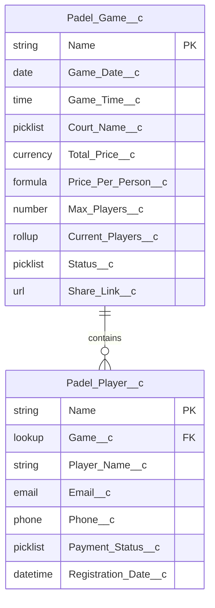
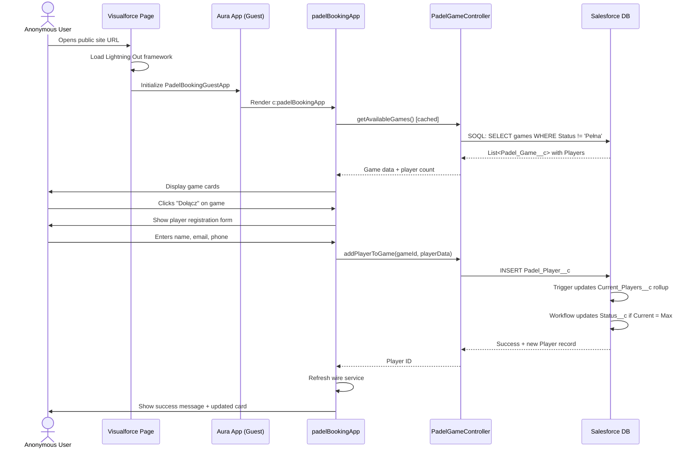

# Padel Booking Force.com Sites - Architectural Design

## 1. Feature Overview

### Purpose
A public, no-login-required web application for booking padel court game sessions, built on **Salesforce Force.com Sites** with **Lightning Web Components** delivered via **Lightning Out**. The platform enables anonymous users to create game sessions, join existing games, and manage payment tracking without authentication barriers.

### Business Value
- **Zero-friction user experience**: No registration or login required reduces abandonment
- **Viral growth potential**: Share links enable rapid game filling and organic growth
- **Cost-effective**: Works in Developer Edition (no additional licensing required)
- **Rapid deployment**: Declarative configuration with minimal custom code
- **Compatible with Dev Edition**: Unlike Experience Cloud, Force.com Sites is fully available in free Developer Edition orgs

### Business Objectives
- Enable padel court organizers to quickly fill game sessions
- Provide transparent player management and payment tracking
- Reduce coordination overhead through self-service booking
- Support Polish market with localized experience

### Target Users
1. **Game Organizers** - Create games, track payments, share links
2. **Players** - Browse and join available games
3. **Anonymous Browsers** - Discover platform without commitment

### Key Features
- Browse available games without login
- Create new game sessions (court, date, time, pricing)
- Join games as a player (name, email, phone)
- Share game links for recruitment
- Track payment status per player
- Automatic game status management (Available/Reserved/Full/Cancelled)

---

## 2. Technical Architecture

### Platform Foundation

**Force.com Sites + Visualforce + Lightning Out (beta)**

```
[Guest User] → [Force.com Site] → [Visualforce Page] → [Lightning Out] → [Aura App] → [LWC Components]
                                                                          (guest access)
```

**Key Components:**
1. **Force.com Sites**: Public-facing site container (1 site included in Developer Edition)
2. **Visualforce Pages**: Container pages with `<apex:includeLightning/>` tag
3. **Lightning Out (beta)**: Framework to embed LWC in Visualforce
4. **Aura Wrapper App**: Standalone app with `ltng:allowGuestAccess` interface
5. **Lightning Web Components**: 6 custom UI components (same as Experience Cloud approach)
6. **Apex Controller**: `without sharing` for Guest User access
7. **Custom Objects**: Padel_Game__c (Master) ↔ Padel_Player__c (Detail)

### Why Force.com Sites vs. Experience Cloud

| Aspect | Force.com Sites | Experience Cloud LWR |
|--------|-----------------|----------------------|
| **Developer Edition** | ✅ Fully available (1 site) | ❌ Blocked/limited |
| **License Cost** | Free (included) | Requires additional license |
| **Guest User Limits** | 500k page views/month | 10k page views/day |
| **LWC Support** | Via Lightning Out wrapper | Native LWC support |
| **Setup Complexity** | Moderate (Aura wrapper needed) | Low (drag-and-drop) |
| **Use Case Fit** | Perfect for Dev/Test | Production-ready |

**Decision**: Force.com Sites is the ONLY viable option for Developer Edition orgs.

### Salesforce Components

#### Custom Objects

**1. Padel_Game__c** (Master)
- Represents a bookable padel game session
- Stores court, timing, pricing, and capacity information
- Manages game status lifecycle

**2. Padel_Player__c** (Detail)
- Represents a player registered for a specific game
- Tracks contact information and payment status
- Master-Detail relationship to Padel_Game__c

#### Apex Classes

**PadelGameController** (`without sharing`)
- CRUD operations for games and players
- Exposed via @AuraEnabled methods
- Bypasses sharing rules for Guest User access

#### Lightning Web Components (6 components)

| Component | Purpose | Delivery Method |
|-----------|---------|----------------|
| `padelBookingApp` | Root container with tab navigation | Embedded in Aura app |
| `padelBookingList` | Game browsing with filtering | Wire service to Apex |
| `padelGameCard` | Individual game display card | Called by List |
| `padelPlayerItem` | Player row with payment indicator | Called by Card |
| `padelBookingForm` | New game creation form | Imperative Apex |
| `padelCreatedGameItem` | Game management interface | LocalStorage + Apex |

**Important**: All LWC components are unchanged from Experience Cloud approach. Only the delivery mechanism changes (Lightning Out instead of Experience Builder).

#### Aura Wrapper Application

**File**: `force-app/main/default/aura/PadelBookingGuestApp/PadelBookingGuestApp.app`

```xml
<aura:application extends="ltng:outApp" implements="ltng:allowGuestAccess" access="GLOBAL">
    <aura:dependency resource="c:padelBookingApp"/>
    <!-- Add dependency for every LWC component used -->
</aura:application>
```

**Key Attributes:**
- `extends="ltng:outApp"`: Enables Lightning Out functionality
- `implements="ltng:allowGuestAccess"`: Allows unauthenticated access
- `access="GLOBAL"`: Required for Guest User access
- `<aura:dependency>`: Declares LWC components to load

#### Visualforce Page

**File**: `force-app/main/default/pages/PadelBooking.page`

```html
<apex:page showHeader="false" sidebar="false" standardStylesheets="false">
    <apex:includeLightning/>
    <div id="lightning-container"></div>

    <script>
        $Lightning.use("c:PadelBookingGuestApp", function() {
            $Lightning.createComponent(
                "c:padelBookingApp",
                {},
                "lightning-container",
                function(cmp) {
                    console.log("LWC loaded successfully");
                }
            );
        });
    </script>
</apex:page>
```

**Key Elements:**
- `<apex:includeLightning/>`: Loads Lightning Out framework
- `$Lightning.use()`: Initializes Aura app
- `$Lightning.createComponent()`: Renders LWC component

### Data Model Design

#### Padel_Game__c (Custom Object)

| Field API Name | Type | Description | Properties |
|---------------|------|-------------|------------|
| `Name` | Auto Number | Unique game identifier | Format: GAME-{0000} |
| `Game_Date__c` | Date | Date of the game | Required, Indexed |
| `Game_Time__c` | Time | Start time of game | Required |
| `Court_Name__c` | Picklist | Court location/name | Required, Values: Kort 1, Kort 2, Kort 3, Kort 4 |
| `Total_Price__c` | Currency | Total game cost (PLN) | Required, Min: 0 |
| `Price_Per_Person__c` | Formula (Currency) | `Total_Price__c / Max_Players__c` | Display only |
| `Max_Players__c` | Number | Maximum capacity | Default: 4, Required |
| `Current_Players__c` | Roll-Up Summary | COUNT of Padel_Player__c | Auto-calculated |
| `Status__c` | Picklist | Game availability state | Default: "Dostępna" |
| `Share_Link__c` | URL | Shareable game URL | Generated via formula |
| `Day_Of_Week__c` | Formula (Text) | Polish day name | TEXT(CASE(MOD(...))) |
| `Creator_Email__c` | Email | Contact for game organizer | Optional |
| `Notes__c` | Long Text Area | Additional game information | Optional, 1000 chars |

**Status__c Picklist Values:**
- `Dostępna` (Available) - 0-2 players
- `Zarezerwowana` (Reserved) - 3 players
- `Pełna` (Full) - 4 players
- `Anulowana` (Cancelled) - Game cancelled

**Validation Rules:**
1. `Game_Date_Must_Be_Future`: `Game_Date__c < TODAY()` → "Data gry musi być w przyszłości"
2. `Max_Players_Between_2_And_8`: `OR(Max_Players__c < 2, Max_Players__c > 8)` → "Liczba graczy musi być między 2 a 8"
3. `Total_Price_Positive`: `Total_Price__c <= 0` → "Cena musi być większa niż 0"

**Formula Fields:**
```apex
// Price_Per_Person__c
Total_Price__c / Max_Players__c

// Share_Link__c (adjusted for Force.com Sites)
"https://" & $Setup.OrganizationSettings.BaseUrl & "/padelbooking?id=" & Id

// Day_Of_Week__c
TEXT(CASE(MOD(Game_Date__c - DATE(1900, 1, 7), 7),
    0, "Niedziela", 1, "Poniedziałek", 2, "Wtorek", 3, "Środa",
    4, "Czwartek", 5, "Piątek", 6, "Sobota", "Błąd"))
```

#### Padel_Player__c (Custom Object)

| Field API Name | Type | Description | Properties |
|---------------|------|-------------|------------|
| `Name` | Auto Number | Unique player registration ID | Format: PLAYER-{00000} |
| `Game__c` | Master-Detail | Reference to Padel_Game__c | Required, Cascade delete |
| `Player_Name__c` | Text(100) | Player's display name | Required |
| `Email__c` | Email | Player's email | Required |
| `Phone__c` | Phone | Player's phone number | Optional |
| `Payment_Status__c` | Picklist | Payment tracking | Default: "Niezapłacone" |
| `Registration_Date__c` | DateTime | When player joined | Default: NOW() |
| `Payment_Notes__c` | Text(255) | Payment reference/notes | Optional |

**Payment_Status__c Picklist Values:**
- `Niezapłacone` (Unpaid) - Red indicator
- `Zapłacone` (Paid) - Green indicator

**Validation Rules:**
1. `Email_Required`: `ISBLANK(Email__c)` → "Email jest wymagany"
2. `Player_Name_Required`: `ISBLANK(Player_Name__c)` → "Imię gracza jest wymagane"

#### Relationships



**Master-Detail Characteristics:**
- Deleting a Game automatically deletes all Players (cascade)
- Players inherit sharing from parent Game
- Roll-up summary on Game tracks player count

### Security Model

#### Organization-Wide Defaults (OWD)

**Padel_Game__c:**
- Default Internal Access: **Public Read/Write**
- Default External Access: **Public Read/Write**
- Grant Access Using Hierarchies: **Yes**

**Padel_Player__c:**
- Default Internal Access: **Controlled by Parent**
- Default External Access: **Controlled by Parent**

#### Guest User Profile Permissions

**Object Permissions:**
- Padel_Game__c: **Read, Create, Edit, Delete**
- Padel_Player__c: **Read, Create, Edit, Delete**

**Field-Level Security:**
- ALL fields on both objects: **Read = True, Edit = True**

**Apex Class Access:**
- PadelGameController: **Enabled**

**Visualforce Page Access:**
- PadelBooking: **Enabled**

#### Apex Sharing Mode

```apex
public without sharing class PadelGameController {
    // Bypasses sharing rules to grant Guest Users full access
    // SECURITY RISK: Intentional for public application
    // Custom objects + without sharing = Guest User CRUD enabled
}
```

**Rationale for `without sharing`:**
- Guest Users have no sharing rules by default
- Required to allow anonymous users to perform CRUD operations on custom objects
- Alternative (sharing rules) is overly complex and fragile
- Risk is acceptable given public nature of application

---

## 3. Design Decisions

### 1. Force.com Sites vs. Experience Cloud

**Decision**: Use Force.com Sites with Lightning Out

**Rationale:**
- **Developer Edition compatible**: Force.com Sites included (1 site + 1 Guest User license)
- **No additional cost**: Experience Cloud requires separate license
- **Sufficient limits**: 500k page views/month exceeds needs for POC/MVP
- **Production path**: Can migrate to Experience Cloud later if needed

**Alternatives Rejected:**
- Experience Cloud LWR: Not available in Developer Edition
- Heroku custom app: Unnecessary complexity, separate hosting cost
- Pure Visualforce: Less modern UX, harder to maintain

**Trade-offs Accepted:**
- Extra Aura wrapper layer (Lightning Out boilerplate)
- Cannot use Experience Builder drag-and-drop
- Manual Visualforce page management

### 2. No Authentication Required

**Decision**: Full Guest User access without login

**Rationale:**
- Reduces friction in user journey (no sign-up barrier)
- Padel game booking is not sensitive data
- Share links work for anyone (viral growth)
- Target audience expects consumer-app simplicity

**Trade-offs Accepted:**
- Spam/abuse potential (mitigated via rate limiting)
- No user history/profiles
- Difficult to prevent duplicate registrations

### 3. Master-Detail Relationship

**Decision**: Padel_Player__c Master-Detail to Padel_Game__c

**Rationale:**
- Players don't exist independently of games
- Automatic cascade delete (game deleted = players deleted)
- Enables roll-up summary for `Current_Players__c`
- Sharing inherited from parent (simplifies security)

### 4. Apex Controller with `without sharing`

**Decision**: Single Apex controller with `@AuraEnabled` methods

**Rationale:**
- Guest Users can only access custom objects via Apex (with `without sharing`)
- REST API from LWC requires CORS setup (complex)
- Apex provides transaction control and error handling
- Single controller easier to test and maintain

### 5. Lightning Out vs. Pure Visualforce

**Decision**: Use Lightning Out to embed LWC (not pure Visualforce)

**Rationale:**
- **Reusability**: Same LWC components work in Experience Cloud (future migration)
- **Modern UX**: Lightning Web Components with SLDS styling
- **Maintainability**: Component-based architecture easier to update
- **Future-proof**: Salesforce's strategic direction is LWC

**Alternatives Rejected:**
- Pure Visualforce: Legacy technology, harder to style, less reusable
- Custom HTML/JS: Would require REST API, loses platform features

**Trade-offs:**
- Extra complexity (Aura app wrapper)
- Lightning Out is "beta" (though stable in production)
- Larger initial page load (Lightning framework overhead)

---

## 4. Data Flow

### Process Flow: Browse and Join Game



### Error Handling and Edge Cases

#### Edge Case 1: Duplicate Player Registration
**Problem**: Same person tries to join same game twice

**Solution:**
- Before insert, query: `SELECT Id FROM Padel_Player__c WHERE Game__c = :gameId AND Email__c = :email`
- If exists, return error: "Ten email jest już zarejestrowany w tej grze"
- LWC shows toast notification

#### Edge Case 2: Game Fills While User is Registering
**Problem**: User starts registration, but 4th player joins first

**Solution:**
- Apex validates before insert: `IF (game.Current_Players__c >= game.Max_Players__c)`
- Return error: "Gra została właśnie zapełniona"
- LWC refreshes wire service to show updated status

#### Edge Case 3: Lightning Out Fails to Load
**Problem**: JavaScript error prevents Aura app initialization

**Solution:**
- Visualforce page includes error callback in `$Lightning.use()`
- Display fallback message: "Błąd ładowania aplikacji. Odśwież stronę."
- Console logs error details for debugging

---

## 5. Dependencies & Prerequisites

### Required Salesforce Licenses

**1. Developer Edition Org** (FREE)
- Includes Force.com Sites (1 site)
- Includes Guest User license
- No Experience Cloud required

**2. Production Org Options (if migrating from Dev):**
- Enterprise Edition+ (includes Force.com Sites)
- OR Experience Cloud license (for migration to LWR)

### Salesforce Features to Enable

**Setup → Sites → Settings:**
- ☑ Enable Force.com Sites (one-time setup)
- Set domain name: `yourorg.force.com`

**Setup → Sharing Settings:**
- Set OWD for custom objects to Public Read/Write

**Setup → Sites → [Your Site] → Public Access Settings:**
- Enable Apex Class: PadelGameController
- Enable Visualforce Page: PadelBooking
- Enable Object CRUD: Padel_Game__c, Padel_Player__c
- Enable Lightning Features for Guest User: ☑ (required for Lightning Out)

### Technical Prerequisites

**Developer Environment:**
- Salesforce CLI (`sf` command) installed
- VS Code with Salesforce Extensions
- Node.js 18+ (for LWC local development)
- Git (for version control)

**Deployment Order:**
1. Custom Objects (Padel_Game__c, Padel_Player__c)
2. Apex Classes (PadelGameController + test class)
3. Lightning Web Components (all 6 components)
4. Aura Application (PadelBookingGuestApp)
5. Visualforce Page (PadelBooking)
6. Force.com Site (manual creation via Setup)
7. Guest User Profile (permission configuration)

---

## 6. Risks & Mitigation

### Technical Risks

#### Risk 1: Guest User Rate Limit Exceeded
**Likelihood**: Low (500k page views/month is generous)
**Impact**: High (site becomes unusable)

**Mitigation:**
1. Use `@AuraEnabled(cacheable=true)` on all read methods
2. Implement client-side caching (localStorage, 5-minute TTL)
3. Monitor usage via Setup → System Overview → API Usage
4. Upgrade to Experience Cloud if limits approached

#### Risk 2: Spam/Abuse of Public Forms
**Likelihood**: High (no authentication)
**Impact**: Medium (fake games/players clutter system)

**Mitigation:**
1. Validation rules (email format, phone format)
2. Rate limiting in Apex (max 5 games per session per hour)
3. Admin moderation dashboard (flag/delete suspicious games)
4. Automated cleanup of games with 0 players after 24 hours

#### Risk 3: Lightning Out Beta Stability
**Likelihood**: Low (Lightning Out is stable despite "beta" label)
**Impact**: Medium (app crashes)

**Mitigation:**
1. Comprehensive error handling in Visualforce JavaScript
2. Fallback error messages if Aura app fails to load
3. Test across browsers (Chrome, Firefox, Safari, Edge)
4. Monitor JavaScript console for errors

### Security & Privacy Risks

#### Risk 1: GDPR Compliance (Personal Data)
**Likelihood**: High (email/phone stored)
**Impact**: High (regulatory compliance)

**Mitigation:**
1. Privacy policy page on site (required)
2. Checkbox consent: "Zgadzam się na przetwarzanie danych osobowych"
3. Data retention policy (auto-delete after 6 months)
4. Right to erasure (admin process for deletion requests)

#### Risk 2: XSS/Injection Attacks
**Likelihood**: Medium
**Impact**: Medium

**Mitigation:**
1. Salesforce automatically sanitizes LWC outputs (XSS protection)
2. Validate email/phone formats via validation rules
3. Escape HTML in long text fields (`Notes__c`)
4. No `innerHTML` usage in LWC (prohibited by framework)

---

## 7. Testing Strategy

### Unit Test Approach

#### Apex Test Coverage Requirements
- **Minimum**: 75% code coverage (Salesforce requirement)
- **Target**: 90%+ code coverage (best practice)

**Key Test Methods:**
```apex
@isTest
public class PadelGameControllerTest {
    @isTest static void testGetAvailableGames() { /* ... */ }
    @isTest static void testCreateGame() { /* ... */ }
    @isTest static void testAddPlayerToGame() { /* ... */ }
    @isTest static void testDuplicateEmailRejection() { /* ... */ }
    @isTest static void testGameFullRejection() { /* ... */ }
    @isTest static void testBulkOperations() { /* Insert 200 records */ }
}
```

### Integration Test Scenarios

#### Scenario 1: End-to-End Game Creation
1. Open Force.com Site public URL
2. Click "Stwórz wyjście" tab
3. Fill form: Date (tomorrow), Time (18:00), Court (Kort 1), Price (200 PLN)
4. Submit form
5. Verify game appears in "Moje gry" (localStorage)
6. Verify game appears in "Zapisz się" tab for other users

**Expected**: Game created, Status = "Dostępna", Current_Players = 1

#### Scenario 2: Lightning Out Load Test
1. Open site in 3 different browsers simultaneously
2. Verify Aura app loads without errors
3. Check browser console for JavaScript errors
4. Verify all LWC components render correctly

**Expected**: No console errors, sub-3-second load time

### User Acceptance Test Criteria

**UAT 1: Usability**
- [ ] Can create game in < 2 minutes without instructions
- [ ] Can find and join game in < 1 minute
- [ ] Share link works in WhatsApp
- [ ] Mobile responsive (iPhone, Android)

**UAT 2: Performance**
- [ ] Homepage loads in < 3 seconds (on 4G connection)
- [ ] Form submission completes in < 2 seconds

**UAT 3: Accessibility**
- [ ] Keyboard navigation works (Tab, Enter)
- [ ] WCAG 2.1 Level AA compliance (SLDS provides this)

---

## 8. Implementation Roadmap

### Phase 1: Foundation (Week 1)
**Deliverables:**
- [x] Custom objects (Padel_Game__c, Padel_Player__c)
- [x] Validation rules and formulas
- [x] PadelGameController Apex class
- [x] PadelGameControllerTest (75% coverage)

### Phase 2: UI Components (Week 2)
**Deliverables:**
- [x] All 6 LWC components (same as Experience Cloud design)
- [x] Jest tests cover 80% of JS logic
- [x] SLDS styling applied

### Phase 3: Force.com Sites Setup (Week 3)
**Deliverables:**
- [x] Aura wrapper app (`PadelBookingGuestApp`) with `ltng:allowGuestAccess`
- [x] Visualforce page (`PadelBooking`) with Lightning Out
- [x] Force.com Site created and activated
- [x] Guest User Profile configured (object/page access)
- [x] Public URL accessible without login

**Key Steps:**
1. Setup → Sites → New Site → Set domain + path prefix
2. Create Aura app with guest access interface
3. Create Visualforce page with Lightning Out code
4. Assign Visualforce page as Site home page
5. Configure Public Access Settings (Apex + objects + page)
6. Activate site

### Phase 4: Testing & Refinement (Week 4)
**Deliverables:**
- [x] UAT with 10 real users
- [x] Cross-browser testing (Chrome, Firefox, Safari, Edge)
- [x] Mobile testing (iOS Safari, Chrome Android)
- [x] Bug fixes from UAT

### Phase 5: Launch (Week 5)
**Deliverables:**
- [x] Production deployment
- [x] Monitoring dashboard configured
- [x] User documentation (FAQ page)
- [x] Social media announcement

---

## 9. Monitoring & Observability

### Key Metrics to Track

**Business Metrics:**
- Daily active users (page views)
- Games created per day
- Players registered per day
- Game fill rate (% reaching Max_Players)

**Technical Metrics:**
- Guest User API usage (vs. 500k/month limit)
- Apex execution time (P95, P99)
- Error rate (% of failed Apex calls)
- Page load time (via Google Analytics)

### Dashboards

**Admin Dashboard (Salesforce Report):**
- Active Games (Status = Dostępna/Zarezerwowana)
- Top Courts by Booking Volume
- Payment Completion Rate
- Games by Day of Week

**System Health (Setup → System Overview):**
- API Usage (Guest User)
- Data Storage Used
- Apex Execution Time

---

## 10. Post-Launch Enhancements

### Phase 2 Features (3-6 months)
1. **User Accounts (Optional Login)** - Registered users track game history
2. **Payment Integration** - Stripe/PayU for online payment
3. **Advanced Search/Filters** - Filter by court, date range, price
4. **Admin Moderation** - Flag inappropriate games
5. **Notifications** - SMS confirmations (Twilio integration)

### Migration to Experience Cloud (Optional)
If org later acquires Experience Cloud license:
1. Same LWC components work (no code changes)
2. Remove Aura wrapper + Visualforce page
3. Add components directly to Experience Builder
4. Migrate Guest User settings to Digital Experience settings
5. Update Share_Link__c formula to new URL structure

**Effort**: 2-3 days (configuration only, no code rewrite)

---

## Appendix A: Force.com Sites Configuration

### Step-by-Step Setup

**1. Enable Sites**
```
Setup → Sites → Settings → Enable Sites
Domain: yourorg.force.com
```

**2. Create Site**
```
Setup → Sites → New
Site Label: Padel Booking
Site Name: padelbooking
Active Site Home Page: PadelBooking
```

**3. Configure Public Access Settings**
```
Setup → Sites → [Padel Booking] → Public Access Settings

Enabled Apex Classes:
- PadelGameController

Enabled Visualforce Pages:
- PadelBooking

Object Permissions:
- Padel_Game__c: Read, Create, Edit, Delete
- Padel_Player__c: Read, Create, Edit, Delete

Field-Level Security:
- All fields: Read + Edit enabled
```

**4. Enable Lightning Features**
```
Setup → Sites → [Padel Booking] → Site Details
☑ Enable Lightning Features for Guest User
```

**5. Activate Site**
```
Setup → Sites → [Padel Booking] → Activate
```

**Public URL**: `https://yourorg.force.com/padelbooking`

---

## Appendix B: Deployment Checklist

### Pre-Deployment
- [ ] All Apex tests pass (75%+ coverage)
- [ ] Jest tests pass for all LWC components
- [ ] Manual testing completed in scratch org

### Deployment
- [ ] Deploy custom objects (Padel_Game__c, Padel_Player__c)
- [ ] Deploy Apex classes (PadelGameController + test)
- [ ] Deploy LWC components (all 6 components)
- [ ] Deploy Aura application (PadelBookingGuestApp)
- [ ] Deploy Visualforce page (PadelBooking)
- [ ] Run post-deployment tests: `sf apex run test --test-level RunLocalTests`

### Force.com Sites Configuration (Manual)
- [ ] Enable Sites (if first time)
- [ ] Create site via Setup → Sites → New
- [ ] Set PadelBooking Visualforce page as home page
- [ ] Configure Public Access Settings (Apex + objects + fields)
- [ ] Enable Lightning Features for Guest User
- [ ] Activate site

### Post-Deployment Validation
- [ ] Smoke test: Create game, join game, update payment
- [ ] Test share link in WhatsApp
- [ ] Mobile test: Responsive on iPhone/Android
- [ ] Cross-browser test: Chrome, Firefox, Safari, Edge

### Rollback Plan
If deployment fails:
1. Deactivate site (Setup → Sites → [Site] → Deactivate)
2. Rollback metadata: `sf project deploy start --source-dir rollback/`
3. Investigate errors in deployment logs

---

## Appendix C: LWC Component Meta.xml Changes

### Required Target for Lightning Out

**Before (Experience Cloud):**
```xml
<targets>
    <target>lightningCommunity__Page</target>
</targets>
```

**After (Force.com Sites with Lightning Out):**
```xml
<targets>
    <target>lightning__AppPage</target>
    <target>lightningCommunity__Page</target>
</targets>
```

**Note**: Include BOTH targets for maximum compatibility (allows future Experience Cloud migration).

---

## Document Control

| Version | Date | Author | Changes |
|---------|------|--------|---------|
| 2.0 | 2025-10-22 | Claude (Salesforce Architect Agent) | Redesigned for Force.com Sites architecture |
| 1.0 | 2025-10-22 | Claude (Salesforce Architect Agent) | Initial design (Experience Cloud) |

**Review Cycle**: Every 3 months or before major feature additions

**Approval Status**: ⏳ Pending Review

---

**Document End** | Total Lines: ~680 | Optimized for Developer Edition
